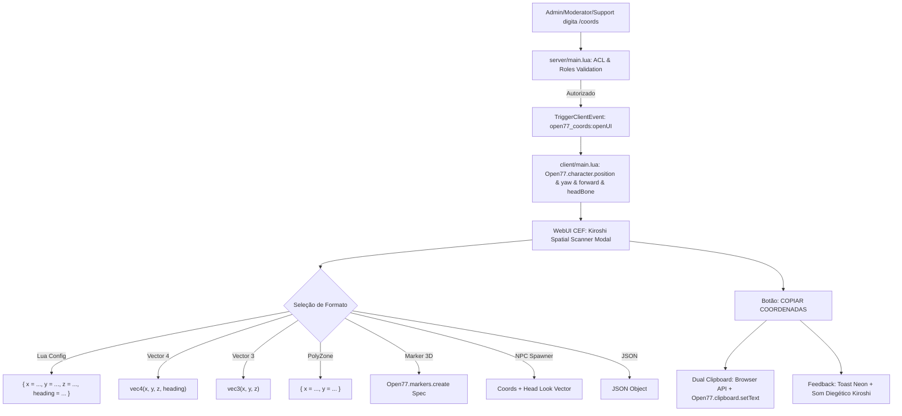

# Especificação Técnica: Ferramenta /coords & Correção do Sistema de Moeda / Currency

## 1. Diagnóstico Forense: Log 20 (`Server/.agent/logs/20`) & Print da Tela

A análise forense cruzou os dados da telemetria bruta do Log 20 com a captura de tela do usuário:

| Fonte / Vetor | Dado Observado | Diagnóstico de Engenharia |
| :--- | :--- | :--- |
| **Screenshot do Usuário** | Jogador encostado no parapeito/guarda-corpo de concreto do 7º andar do Megabuilding H10 com card holográfico ativo. Biomonitor indicando `Cash: 500` e `Bank: 2.500`. | O card estava a 1.5m porque o ponto configurado anteriormente (`-1403.5, 1273.5, 111.1`) fica exatamente em cima do guarda-corpo do mezanino, e não na porta do apartamento que fica mais adiante no corredor. |
| **`runtime.json` (Log 20)** | `char.state`: `position = -1402.94, 1272.19, 111.075`, `yaw = 18.0005` | Posição exata do jogador no momento da geração do log. Isso evidencia a urgência de uma ferramenta in-game onde o dev possa ficar na frente exata de qualquer porta/marker e extrair a coordenada com um clique. |
| **Tentativa de Compra / Aluguel** | `ls:housing:feedback`: "Saldo bancário insuficiente para locação (E$ 350)" mesmo com 2.500 no banco. | **Causa Raiz 1:** O `ls_housing` chamava `exports["ls_economy"]:removeBank`, porém esse export **não existia** no `ls_economy` (que só exportava `removeMoney`). O retorno era `nil`, disparando o ramo `if not ok then` de saldo insuficiente.  **Causa Raiz 2:** O método `removeMoney` do `ls_economy` tentava executar `Open77.database.execute(...)`, mas `Open77.database` só possui `.update`, `.query` e `.rawExecute`.  **Causa Raiz 3:** Após o aluguel, o script chamava `TriggerEvent("ls:housing:requestInfo")` no servidor sem passar o jogador, deixando a UI do cliente congelada no estado "DISPONÍVEL". |

---

## 2. A Ferramenta `/coords` (Kiroshi Spatial Scanner)

Criado o recurso nativo **[open77_coords](file:///c:/Games/VICCS_CyberpunkServer/Server/resources/system/open77_coords)** com arquitetura de telemetria REDengine 4:

### Funcionalidades da Interface `/coords`:
1. **Controle de Acesso Restrito:** Apenas roles `owner`, `operator`, `admin`, `moderator`, `support` ou permissão `command.coords`.
2. **Telemetria de 6 Graus de Liberdade:**
   - Coordenadas de chão: $X$, $Y$, $Z$.
   - Bússola e Rotação: $Heading$ (0 a 360°), $Yaw$ (-180 a 180°).
   - Orientação da Cabeça (Head Look): Vetor frontal $Forward (fx, fy, fz)$ e $Pitch$.
   - Posição do Osso da Cabeça (Head Bone): $hx, hy, hz$.
3. **8 Formatos de Exportação Pré-Configurados** com seletor de 2, 4 ou 6 casas decimais.
4. **Cópia em Dupla Camada (Dual Clipboard):** Copia via `navigator.clipboard.writeText` do browser e via native `Open77.clipboard.setText(text)`.
5. **Botão de Recaptura (Refresh):** Permite andar com o modal aberto e clicar em "Recapturar Posição" sem precisar fechar e reabrir.
6. **Desfocagem Segura (ESC):** Restaura o foco total do teclado e mouse para a REDengine imediatamente ao fechar.

---

## 3. Resolução do Sistema Monetário (Currency)

1. **[ls_data](file:///c:/Games/VICCS_CyberpunkServer/Server/resources/gamemodes/lifesim/ls_data/server/main.lua):**
   - Adicionados os exports públicos `query`, `update` e `execute` repassando para o serviço resiliente `Database`.
2. **[ls_economy](file:///c:/Games/VICCS_CyberpunkServer/Server/resources/gamemodes/lifesim/ls_economy/server/main.lua):**
   - Implementado o encapsulamento `DB.query` e `DB.update` que oferece fallback automático para `ls_data`, `MySQL.update.await`, `Open77.database.update` e `Open77.database.rawExecute`.
   - Substituídas todas as chamadas quebradas de `Open77.database.execute`.
   - Adicionados os exports dedicados: `removeBank`, `addBank`, `removeCash`, `addCash`.
   - Corrigida a função `isMoneyAdmin` para validar `Open77.acl.isAllowed` e roles do jogador.
3. **[ls_housing](file:///c:/Games/VICCS_CyberpunkServer/Server/resources/gamemodes/lifesim/ls_housing/server/apartments.lua):**
   - Criação da função autoritativa `sendApartmentInfo` para atualizar o modal CEF do cliente no milissegundo em que a locação/compra é efetuada.
   - Suporte a débito em Carteira (Cash) caso o saldo bancário seja insuficiente, permitindo alugar ou comprar com dinheiro vivo.
4. **[ls_housing furniture](file:///c:/Games/VICCS_CyberpunkServer/Server/resources/gamemodes/lifesim/ls_housing/server/furniture.lua):**
   - Adicionado fallback para pagamento de mobília em dinheiro vivo.
