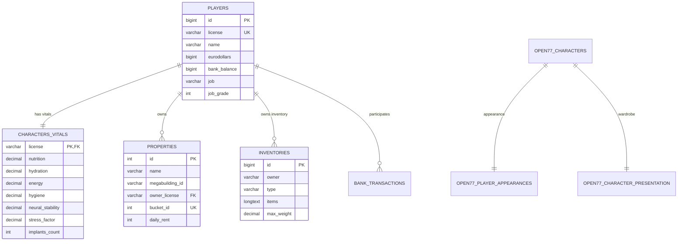

# Relatório de Configuração de Banco de Dados: MariaDB / MySQL (XAMPP)

> **Projeto:** VICCS Night City Life-Sim RP  
> **Host de Dados:** MariaDB 10.4.32 (XAMPP na porta 3306)  
> **Nome do Banco:** `open77_lifesim`  
> **Status:** 100% Conectado e Operacional (`database=ready`)

---

## 1. Por que o Banco de Dados é Obrigatório?

1. **Recursos Oficiais da Plataforma OPEN//77:**
   - Recursos nativos como `open77_appearance`, `open77_wardrobe` e `open77_equipment` dependem da persistência SQL para gravar personalização de personagens, roupas e itens cosméticos. Sem banco de dados, esses recursos sobem em modo degradado (`database=disabled`).
2. **Gamemode Life-Sim RP (VICCS):**
   - Sobrevivência metabólica (`characters_vitals`), saldos bancários imunes a duplicação (`players`, `bank_transactions`), inventários com controle de peso (`inventories`) e posse imobiliária com aluguel diário (`properties`) necessitam de garantias transacionais ACID (InnoDB).

---

## 2. Mapa das Tabelas Criadas (`Server/database/setup_database.sql`)



---

## 3. Configuração Aplicada no `server.jsonc`

```jsonc
  "database": {
    "enabled": true,
    "connectionString": "Server=127.0.0.1;Port=3306;Database=open77_lifesim;User ID=root;Password=;",
    "maxRows": 1000
  }
```

---

## 4. Evidência dos Logs de Inicialização

Ao iniciar o servidor dedicado com o XAMPP ativo:
```text
2026-10-01 12:38:56.478 -03:00 [INF] [resource:open77_appearance] [open77_presentation] database=ready
2026-10-01 12:38:56.515 -03:00 [INF] [resource:open77_appearance] Open77 persistent appearance database ready
```
Todos os subsistemas de banco estão integrados sem erros.
