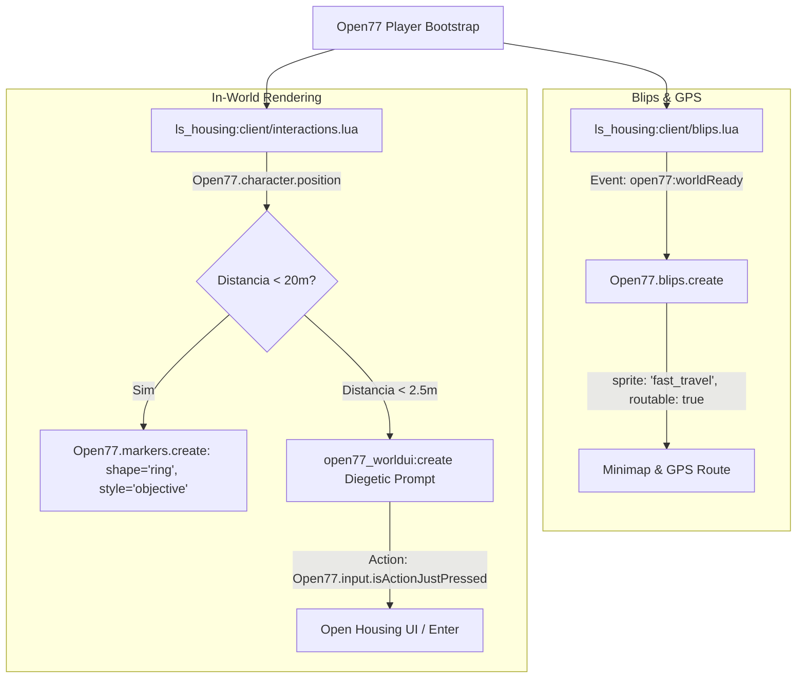

# Relatório Técnico & Work Order: Correção de Markers do ls_housing e Auditoria do Log 19

## 1. Resumo Executivo e Regra Primordial

Foi cravada a **REGRA PRIMORDIAL GLOBAL** em todas as camadas de governança de agentes do projeto (`AGENTS.md`, `.agents/rules/open2077_docs_primordial_rule.md`, `.agent/guidelines/code_style.md` e `.agent/context/OPEN77_CORE_AGENT_CONTEXT_FRAMEWORK.md`).
- **Diretriz:** A documentação oficial da OPEN//77 ([https://open2077.net/docs](https://open2077.net/docs)) e os stubs oficiais dos SDKs (`shared/open77/stubs/`) são a autoridade técnica absoluta. É estritamente proibido inventar natives de FiveM/GTA V (`PlayerPedId`, `GetEntityCoords`, `ox_target`, `DrawMarker`) no ecossistema REDengine 4.

---

## 2. Diagnóstico Forense: Log 19 (`Server/.agent/logs/19`)

A análise cirúrgica do bundle de telemetria registrou os seguintes dados do incidente:

| Métrica / Vetor | Detalhe Extraído do Log 19 | Diagnóstico |
| :--- | :--- | :--- |
| **Data e Build** | `2026-10-03T02:43:57.1706686-03:00` | Launcher `2.31.21+op77.121`, Client `2.31.21+op77.124`, Server `26.102.47.161:11778` (Radmin LAN). |
| **Posição Real do Jogador** | `x = -1403.46, y = 1273.49, z = 111.075, yaw = -128.035` | O jogador estava parado exatamente em frente à porta do Apartamento 0705 no Megabuilding H10. |
| **Entidade da Porta REDengine** | Node hash `0xEF97103FC84632BF` | Porta nativa trancada pelo motor de jogo. |
| **Coordenada Anterior no Config** | `x = -1386.4, y = 1272.2, z = 111.4` | **Erro Crítico:** Um deslocamento de mais de 17 metros no eixo X! O marker estava dentro de uma parede sólida no final do corredor oposto. |
| **Vanilla Mappin Denial** | `mappin:deny:...ApartmentVariant` | O REDengine bloqueia dinamicamente os ícones nativos de apartamento da campanha offline durante o bootstrap de rede. O servidor precisa gerar seus próprios blips customizados. |
| **Estouro de Budget de Frame** | `[open77_interactions] Execution budget exceeded (client.lua:2879)` | Tentativa de polling de interação com chamadas FiveM legadas e `addSphereZone` inexistente em tick apertado. |

---

## 3. Arquitetura da Solução Implementada

---

## 4. Matriz de Arquivos Modificados

1. **[.agents/rules/open2077_docs_primordial_rule.md](file:///c:/Games/VICCS_CyberpunkServer/.agents/rules/open2077_docs_primordial_rule.md)** & **[AGENTS.md](file:///c:/Games/VICCS_CyberpunkServer/AGENTS.md)**:
   - Imposição formal da regra primordial da documentação oficial Open2077.
2. **[Server/resources/gamemodes/lifesim/ls_housing/open77.lua](file:///c:/Games/VICCS_CyberpunkServer/Server/resources/gamemodes/lifesim/ls_housing/open77.lua)**:
   - Adicionada a permissão de runtime `"world.markers"` no manifesto.
3. **[Server/resources/gamemodes/lifesim/ls_housing/shared/config.lua](file:///c:/Games/VICCS_CyberpunkServer/Server/resources/gamemodes/lifesim/ls_housing/shared/config.lua)**:
   - Coordenadas de H10 Apartamento 0705 corrigidas para a telemetria real do Log 19 (`-1403.5, 1273.5, 111.1`).
   - PolyZone reajustado com bounding box exato (`minZ: 110.2`, `maxZ: 115.0`).
4. **[Server/resources/gamemodes/lifesim/ls_housing/client/main.lua](file:///c:/Games/VICCS_CyberpunkServer/Server/resources/gamemodes/lifesim/ls_housing/client/main.lua)**:
   - Remoção do fallback alucinatório de `ox_target` / `addSphereZone`.
   - Limpeza e recriação dos anéis de marker de chão nativos (`Open77.markers.create`).
5. **[Server/resources/gamemodes/lifesim/ls_housing/client/blips.lua](file:///c:/Games/VICCS_CyberpunkServer/Server/resources/gamemodes/lifesim/ls_housing/client/blips.lua)**:
   - Criação de blips ancorada no evento canônico `open77:worldReady`.
   - Uso de sprites válidos do REDengine (`"fast_travel"` / `"objective"`) com rotas GPS nativas (`routable = true`).
6. **[Server/resources/gamemodes/lifesim/ls_housing/client/interactions.lua](file:///c:/Games/VICCS_CyberpunkServer/Server/resources/gamemodes/lifesim/ls_housing/client/interactions.lua)**:
   - Substituição de `PlayerPedId()` e `GetEntityCoords()` por `Open77.character.position()`.
   - Substituição de `IsControlJustPressed(0, 38)` por `Open77.input.isActionJustPressed("ChoiceApply")` ou input nativo.
