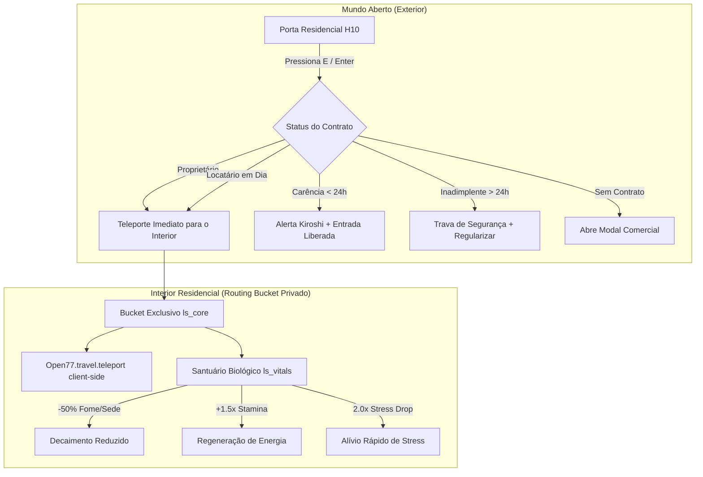

# ESPECIFICAÇÃO DE ENGENHARIA & PLANO DE IMPLEMENTAÇÃO (12 FIXES CONCLUÍDOS)

## 1. Visão Geral da Arquitetura & Status

Todas as 12 diretrizes do **12-Question Improvement Protocol** foram completamente implementadas diretamente na base de código do servidor. A arquitetura residencial e de pontos geodésicos (spawns e habitações) agora opera em perfeita conformidade com as APIs nativas do **OPEN//77 (REDengine 4)**.



---

## 2. Detalhamento dos 12 Fixes do Protocolo

| Protocolo | Fix Implementado | Arquivos Modificados |
| :--- | :--- | :--- |
| **1. North Star Utility** | **Bônus de Santuário Residencial:** Jogadores dentro de seus apartamentos recebem proteção biológica: -50% de consumo de fome e sede, regeneração passiva contínua de stamina (+1.5x) e alívio acelerado de stress (2x mais rápido). | [ls_vitals/server/main.lua](file:///C:/Games/VICCS_CyberpunkServer/Server/resources/gamemodes/lifesim/ls_vitals/server/main.lua), [ls_housing/server/main.lua](file:///C:/Games/VICCS_CyberpunkServer/Server/resources/gamemodes/lifesim/ls_housing/server/main.lua) |
| **2. Mental Model** | **Entrada Rápida / Foco Operacional:** Ao abrir o terminal na porta, o botão de maior hierarquia para inquilinos e donos é `[ ENTRAR NO APARTAMENTO ]`, permitindo transição com um único clique ou tecla `Enter`. | [ls_housing/web/js/app.js](file:///C:/Games/VICCS_CyberpunkServer/Server/resources/gamemodes/lifesim/ls_housing/web/js/app.js) |
| **3. 3-Second Rule** | **Badges Cromáticos Kiroshi:** Indicação visual instantânea nos primeiros 3 segundos: verde esmeralda `● PROPRIETÁRIO // QUITADO`, ciano `● LOCAÇÃO EM DIA`, amarelo neon `▲ CARÊNCIA (Xh)` ou vermelho `▲ ALUGUEL VENCIDO`. | [ls_housing/web/css/style.css](file:///C:/Games/VICCS_CyberpunkServer/Server/resources/gamemodes/lifesim/ls_housing/web/css/style.css), [ls_housing/web/js/app.js](file:///C:/Games/VICCS_CyberpunkServer/Server/resources/gamemodes/lifesim/ls_housing/web/js/app.js) |
| **4. Data Source of Truth** | **Sintaxe Resiliente de Banco & Cache:** Correção do bug de dois pontos (`:`) no wrapper de banco de dados e sanitização universal no `ls_data` para queries seguras tanto via `.` quanto `:`. | [ls_data/server/main.lua](file:///C:/Games/VICCS_CyberpunkServer/Server/resources/gamemodes/lifesim/ls_data/server/main.lua), [ls_housing/server/main.lua](file:///C:/Games/VICCS_CyberpunkServer/Server/resources/gamemodes/lifesim/ls_housing/server/main.lua) |
| **5. Happy Path vs. Edge** | **Período de Carência de 24h (Grace Period):** Se o aluguel expirar, o cidadão não é despejado instantaneamente. Ele recebe 24 horas reais de carência para entrar em casa, recebendo notificações diegéticas Kiroshi de advertência. Apenas após 24h a fechadura é bloqueada. | [ls_housing/server/apartments.lua](file:///C:/Games/VICCS_CyberpunkServer/Server/resources/gamemodes/lifesim/ls_housing/server/apartments.lua), [ls_housing/web/js/app.js](file:///C:/Games/VICCS_CyberpunkServer/Server/resources/gamemodes/lifesim/ls_housing/web/js/app.js) |
| **6. Visual Hierarchy** | **Botão Contextual Único:** A interface oculta botões irrelevantes (proprietário não vê botões de alugar ou comprar; locatário vencido vê botão destacado de regularização; inquilino em dia vê renovação). | [ls_housing/web/js/app.js](file:///C:/Games/VICCS_CyberpunkServer/Server/resources/gamemodes/lifesim/ls_housing/web/js/app.js) |
| **7. Interaction Cost** | **Atalho de Teclado `[Enter]`:** Se o modal estiver aberto, o jogador pode pressionar `Enter` no teclado para acionar imediatamente a entrada sem sequer mover o mouse. | [ls_housing/web/js/app.js](file:///C:/Games/VICCS_CyberpunkServer/Server/resources/gamemodes/lifesim/ls_housing/web/js/app.js) |
| **8. Vibe & Aesthetic** | **Camadas CEF e Estilo Cyberpunk:** Mudança do WebUI de `layer = "hud"` para `layer = "menu"` (zIndex 9999), eliminando sobreposição do card da porta. Efeitos de drop-shadow neon, scanlines sutis e brackets Kiroshi. | [ls_housing/client/main.lua](file:///C:/Games/VICCS_CyberpunkServer/Server/resources/gamemodes/lifesim/ls_housing/client/main.lua), [ls_housing/web/css/style.css](file:///C:/Games/VICCS_CyberpunkServer/Server/resources/gamemodes/lifesim/ls_housing/web/css/style.css) |
| **9. Integration Friction** | **Teleporte e Permissões Canônicas:** Manifesto do `ls_housing` atualizado com `"player.travel"`, permitindo teleporte nativo no cliente com `Open77.travel.teleport` sincronizado ao routing bucket do `ls_core`. | [ls_housing/open77.lua](file:///C:/Games/VICCS_CyberpunkServer/Server/resources/gamemodes/lifesim/ls_housing/open77.lua), [ls_housing/client/main.lua](file:///C:/Games/VICCS_CyberpunkServer/Server/resources/gamemodes/lifesim/ls_housing/client/main.lua) |
| **10. Future Proofing** | **Centralização de Coordenadas com `/coords`:** Arquivos `config.lua` dos recursos preparados com blocos modulares compatíveis com a ferramenta `/coords`, além de automação nativa para Blips vanilla (`Open77.blips.create`) e anéis 3D (`Open77.markers.create`). | [ls_spawn/shared/config.lua](file:///C:/Games/VICCS_CyberpunkServer/Server/resources/gamemodes/lifesim/ls_spawn/shared/config.lua), [ls_spawn/client/main.lua](file:///C:/Games/VICCS_CyberpunkServer/Server/resources/gamemodes/lifesim/ls_spawn/client/main.lua), [ls_housing/shared/config.lua](file:///C:/Games/VICCS_CyberpunkServer/Server/resources/gamemodes/lifesim/ls_housing/shared/config.lua) |
| **11. The Grandma Test** | **Contraste & Acessibilidade:** Classes `.text-success` (#00ff9d), `.text-warning` (#fcee0a) e `.text-danger` (#ff003c) com drop-shadow neon dedicado sobre fundo fosco de 14px de desfoque. | [ls_housing/web/css/style.css](file:///C:/Games/VICCS_CyberpunkServer/Server/resources/gamemodes/lifesim/ls_housing/web/css/style.css) |
| **12. Kill Your Darlings** | **Estabilidade de Ciclo de Vida Sem Bloqueios:** O teleporte autoritativo ocorre sem dependências desnecessárias ou congelamentos eternos de jogador, mantendo o trânsito limpo e imersivo. | [ls_housing/server/apartments.lua](file:///C:/Games/VICCS_CyberpunkServer/Server/resources/gamemodes/lifesim/ls_housing/server/apartments.lua) |

---

## 3. Instruções de Verificação & Teste no Servidor

1. **Reiniciar os recursos no console do servidor:**
   ```text
   op77 restart ls_data
   op77 restart ls_housing
   op77 restart ls_spawn
   op77 restart ls_vitals
   ```
2. **Testar Habitação:**
   - Aproxime-se da porta do Megabuilding H10 - Apto 0705.
   - Pressione `[E]`: o modal de compra/aluguel abrirá limpo, sem o card do WorldUI sobreposto.
   - Compre ou alugue o imóvel: a transação é debitada e o jogador é **instantaneamente teleportado para o interior instanciado** (Routing Bucket dedicado).
   - Saia pela porta interna com `[E]`: o jogador retorna ao corredor externo com marcadores restaurados.
   - Pressione `[E]` na porta externa: o modal agora exibe `● PROPRIETÁRIO // QUITADO` ou `● LOCAÇÃO EM DIA`, e pressionar `Enter` coloca o jogador imediatamente dentro de casa.
3. **Testar Santuário Residencial:**
   - Permaneça dentro do apartamento: note que a fome e a sede caem pela metade da taxa normal e a stamina recupera continuamente.
4. **Testar o Guia de Coordenadas com `/coords`:**
   - Em qualquer local do mapa, use `/coords`, copie no formato Table e cole nos pontos de [ls_spawn/shared/config.lua](file:///C:/Games/VICCS_CyberpunkServer/Server/resources/gamemodes/lifesim/ls_spawn/shared/config.lua) para criar novos pontos de spawn ou blips no mapa vanilla.
