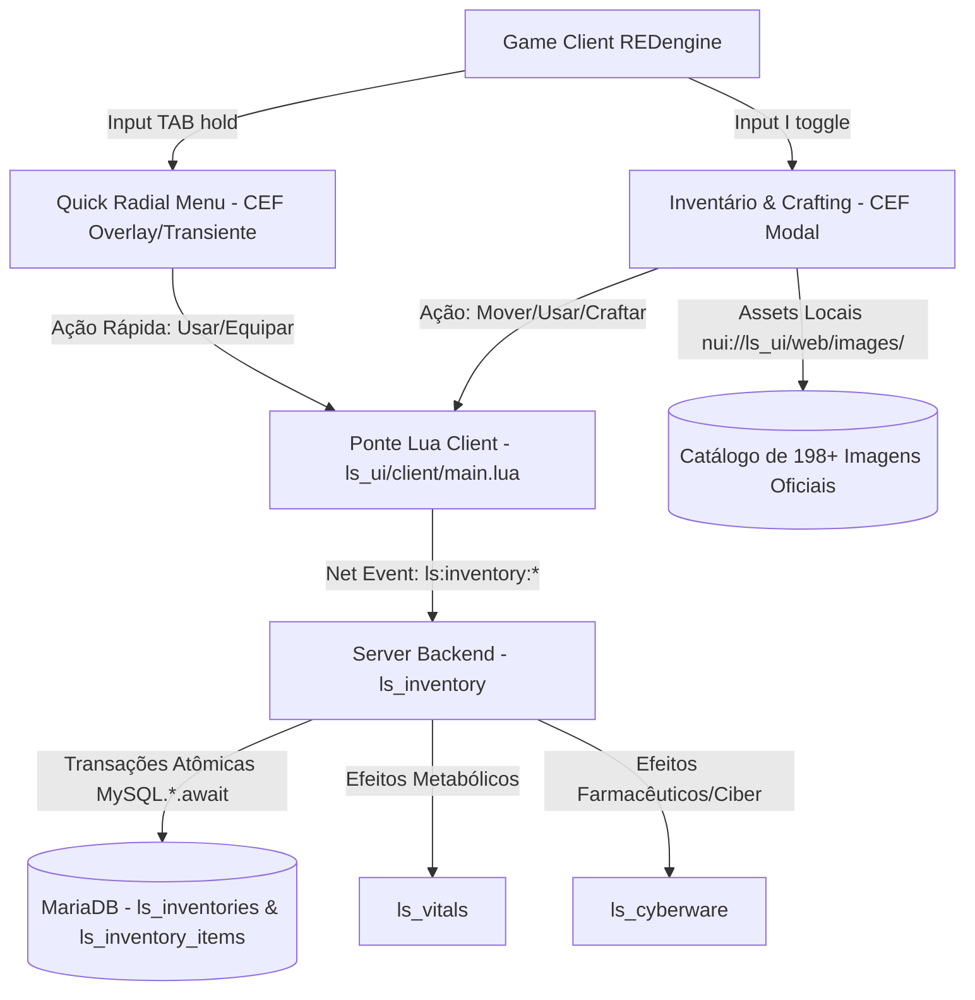

# Especificação Técnica & Plano de Implementação: Inventário, Crafting & Radial Menu

**Projeto:** VICCS Cyberpunk Server (`open77_lifesim`)  
**Plataforma:** Cyberpunk 2077 (v2.31) + OPEN//77 Build `2.31.21+op77.124`  
**Engenheiro Responsável:** The Universal Engineer (UEoE 1)  
**Status:** Aprovado para Execução

---

## 1. Visão Geral da Arquitetura

O pacote adiciona três componentes interconectados ao ecossistema Life-Sim:

---

## 2. Componentes a Serem Implementados

### Componente 1: Pipeline de Assets de Imagens Oficiais
- **Destino:** `Server/resources/gamemodes/lifesim/ls_ui/web/images/`
- **Conteúdo:** 198 imagens de alta fidelidade em formato PNG transparente extraídas da REDengine (Cyberpunk 2077):
  - Todas as armas do jogo (`weapon_achilles.png`, `weapon_ajax.png`, `weapon_ashura.png`, `weapon_katana.png`, `weapon_nue.png`, etc.).
  - Consumíveis e mantimentos (`burrito.png`, `coffee.png`, `water.png`, etc.).
  - Farmácia e estimulantes (`maxdoc.png`, `bounce_back.png`, `neuroblocker.png`).
  - Munições por calibre (`ammo_handgun.png`, `ammo_rifle.png`, `ammo_shotgun.png`, `ammo_sniper.png`).
  - Materiais de crafting (`component_common.png`, `component_rare.png`, `upgrade_part.png`, `circuit.png`, etc.).
- **Garantia de Fallback:** Fallback automático via SVG estilizado Kiroshi caso um item customizado não possua PNG correspondente.

---

## 2. Componentes Implementados

### Componente 2: Recurso Backend `ls_inventory`
- **Caminho:** `Server/resources/gamemodes/lifesim/ls_inventory/`
- **Estrutura:**
  - `open77.lua`: Manifesto declarando dependências `ls_core`, `ls_data` e permissão `state.write`.
  - `shared/items_catalog.lua`: Catálogo completo de itens, raridades (Comum, Incomum, Raro, Épico, Lendário), pesos, limites de empilhamento (*max_stack*), tipo e efeitos (Fome, Sede, Estresse, Dano).
  - `shared/crafting_recipes.lua`: Lista de receitas com materiais requeridos, nível de habilidade, tempo de fabricação (em segundos) e rendimento.
  - `server/main.lua`: 
    - Carregamento e cache dos containers do jogador via `ls_data`.
    - Validação de peso máximo (`max_weight`).
    - Consumo seguro de itens com validação server-side.
    - Execução do crafting com débito de materiais e geração atômica do produto.
    - Persistência em MariaDB nas tabelas `ls_inventories` e `ls_inventory_items`.
  - `client/main.lua`:
    - Tecla de atalho `I` (ou comando `/inventory`) para abrir o modal.
    - Sincronização de abertura com porta-malas de veículos e baús de apartamentos.

---

### Componente 3: Interface WebUI (Inventário + Crafting) em `ls_ui`
- **Destino:** Integrado à página única CEF `Server/resources/gamemodes/lifesim/ls_ui/web/`
- **Markup (`index.html`):**
  - Modal `#inventory-modal` com duas colunas dinâmicas:
    - **Esquerda:** Mochila do Jogador (Grid de 40 slots, peso corporal, atalhos rápidos 1 a 4).
    - **Direita:** Alternador entre **Segundo Container** (Porta-malas/Baú) e **Bancada de Crafting**.
  - **Aba de Crafting:**
    - Filtros de categoria: Armas, Munições, Medicina/Vitals, Aprimoramentos.
    - Detalhe da receita: Lista de materiais necessários com contagem visual `[x/y]` (verde se tem, vermelho se falta).
    - Botão "FABRICAR" Kiroshi com animação de progresso holográfica e temporizador visual.
- **Estilos (`app.css`):**
  - Glassmorphism diegético Kiroshi Optics (`#080E19`, bordas chanfradas angulares, badges de raridade).
- **Controlador (`app.js`):**
  - Drag & drop de itens entre slots e containers.
  - Duplo-clique para consumir/equipar.
  - Tooltips diegéticos dinâmicos exibindo atributos do item sob o cursor.

---

### Componente 4: Quick Radial Menu (Equipamentos, Armas e Comida)
- **Localização:** Integrado em `ls_ui` (WebUI + Client Lua)
- **Ativação:** Segurar a tecla `TAB` (ou comando mapeado).
- **Interface:**
  - Roda holográfica Kiroshi de 6 a 8 setores angulares.
  - Central: Ícone do item selecionado, nome e efeito.
  - Ao mover o cursor em direção a um setor: destaque com som Kiroshi e seleção do slot.
  - Ao soltar a tecla `TAB`: ação disparada instantaneamente (se for arma -> equipa; se for comida/remédio -> consome).
  - Transiente e ultra-rápido: não trava a câmera nem congela a experiência do jogador.
