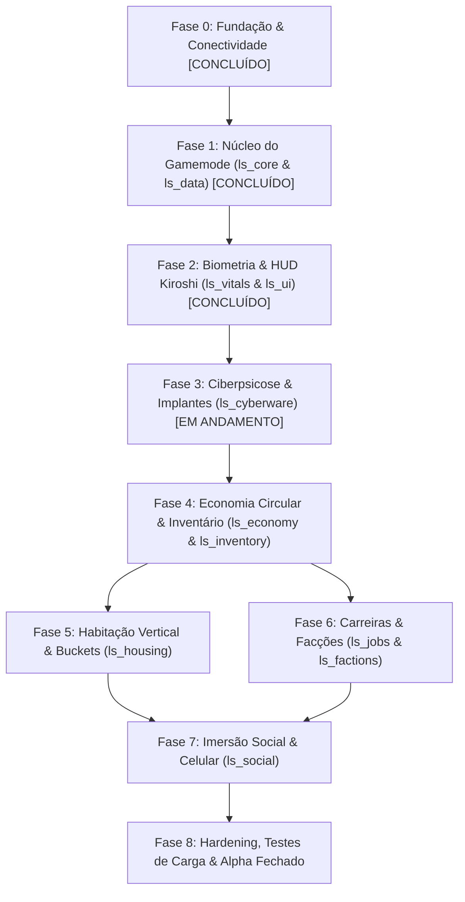

# OPEN//77 Night City Life-Sim RP — Plano Mestre de Implementação & Roadmap

> **Status:** Fases 0, 1 e 2 Concluídas & Validadas In-Game | Fase 3 em Preparação  
> **Target:** Cyberpunk 2077 v2.31 + Phantom Liberty / Plataforma OPEN//77 (Build 2.31.21+op77.121)  
> **Gamemode:** `gamemodes/lifesim/`  

---

## 1. Visão Geral & Decisões Arquiteturais Consolidadas

O projeto transforma Night City em uma plataforma persistente de simulação social e biológica profunda (*Life-Sim*), inspirada no ciclo vital de *The Sims 4* e inserida na distopia transumanista de *Cyberpunk 2077*.

### Matriz de Resolução de Divergências (GDD vs. Plataforma Real)

| Componente | Premissa Inicial (GDD) | Realidade OPEN//77 (Oficial) | Decisão Arquitetural Fixada |
| :--- | :--- | :--- | :--- |
| **Banco de Dados** | PostgreSQL 16 + PgBouncer | Bridge oficial suporta **MySQL / MariaDB** | **MariaDB 10.4.32+ (InnoDB)** com transações ACID (`SELECT ... FOR UPDATE`), índices e colunas `JSON`. |
| **Cache de Biometria** | Redis 7 | Redis não é nativo na plataforma | **`CacheService` in-memory em Lua 5.4** com padrão *Write-Behind* (flush a cada 5m, disconnect e shutdown). |
| **Transações Financeiras** | Redis + Sync Postgres | Risco de duplicação por cache | **Transações síncronas imediatas no MariaDB** sem cache intermediário (`ls_ledger` append-only). |
| **Interface NUI** | Variável / React | Chromium CEF / WebView2 out-of-process | **Vanilla CSS + HTML5 + JS puro / Web Audio API** com tokens Kiroshi oficiais, chanfros 45° via `clip-path` e zero overhead de VDOM. |
| **Identificadores** | Mistura de int / string | REDengine 64-bit int vs Sessão int | **IDs de Entidade REDengine são opacos** (nunca `tonumber`). **IDs de Sessão usam `tonumber`**. Chave de persistência é a `license`. |
| **Voz & Comunicação** | Sistema genérico | `open-voice` integrado | **`open-voice` nativo** com atenuação 3D, oclusão por paredes e filtro diegético de holocall. |

---

## 2. Estrutura Canônica de Recursos (`Server/resources/gamemodes/lifesim/`)

```text
Server/resources/gamemodes/lifesim/
├── _shared/            # Módulos puros compartilhados (ls_shared.lua)
├── ls_core/            # [CONCLUÍDO] Identidade, sessões, lifecycle, gate, placement e registry
├── ls_data/            # [CONCLUÍDO] Migrations MariaDB, CacheService (write-behind), repositórios
├── ls_vitals/          # [CONCLUÍDO] Motor de biometria (nutrição, água, energia, higiene, stress)
├── ls_ui/              # [CONCLUÍDO] Frontend Kiroshi Biomonitor HUD diegético (WebUI CEF)
├── ls_cyberware/       # [PRÓXIMO] Implantes, calor ocular, estabilidade neural e ciberpsicose
├── ls_economy/         # Sistema bancário, dinheiro, carteira, ledger e money sinks
├── ls_inventory/       # Inventário em slots/peso, itens usáveis e containers
├── ls_housing/         # Megabuildings, routing buckets, elevadores, portas e build mode
├── ls_jobs/            # Carreiras corporativas, serviços públicos, turnos e salários
├── ls_factions/        # NCPD, Trauma Team, Fixers, contratos e reputação
└── ls_social/          # Bares, animações sincronizadas, afinidade social e smartphone
```

---

## 3. Roadmap Detalhado de Implementação por Fases



---

### Fase 0: Fundação, Infraestrutura & Conectividade (100% CONCLUÍDA)
- [x] Extração e scaffold do servidor OPEN//77 v2.31.21+op77.121.
- [x] Banco de dados `open77_lifesim` estruturado no MariaDB local (XAMPP).
- [x] Correção de compatibilidade da build (`expectedGameBuild = 23100`).
- [x] Ajuste do alvará Master Server (`publicEndpoint = 147.185.221.213:5494`).
- [x] Validação in-game: jogador `viccs` conectado com sucesso em Night City.

---

### Fase 1: Núcleo do Gamemode & Persistência Reativa (100% CONCLUÍDA)
**Objetivo:** Criar a fundação estrutural do gamemode onde os jogadores são carregados, autenticados e têm seus dados salvos de forma confiável.

- [x] **Módulo `ls_core`:**
  - [x] Manifesto declarativo `open77.lua` com permissões `network.events`, `state.write`, `players.gate`, `acl.read`, `players.teleport`.
  - [x] Resolução de identidade autenticada (`license`, `userId`, `name`).
  - [x] Roteamento de sessão via máquina de estados de 5 fases (`connected`, `loading`, `loaded`, `rejected`, `dropped`).
  - [x] Gate de prontidão da plataforma integrado com liberação condicionada à sincronização de perfil.
  - [x] Registro central de submódulos (`exports.registerModule`) com limite de cota de memória para State Bags (máximo de 2048 bytes por módulo).
  - [x] Posicionamento inicial seguro (`spawnDefault` nos Badlands) e comandos administrativos protegidos (`/ls_goto`, `/ls_bring`, `/ls_status`, `/ls_modules`).
  - [x] Handshake do cliente (`clientReady`) ao receber `open77:worldReady`.
- [x] **Módulo `ls_data`:**
  - [x] Migrador automático de esquemas SQL declarativo com controle de versão em `ls_schema_migrations`.
  - [x] Migração inicial v1 de `ls_core` / `ls_players` aplicada no MariaDB.
  - [x] `CacheService` síncrono em memória com flush assíncrono em thread contínua (5 min) e persistência garantida em `onPlayerDisconnected` e shutdown.
  - [x] Isolamento de dados por namespaces (`profile`, `vitals`).
- [x] **Testes de Aceitação da Fase 1:**
  - [x] Jogador entra no servidor -> registro criado em `ls_players` -> reconexão lê dados existentes sem duplicar.

---

### Fase 2: Biometria, Vitais & HUD Kiroshi (100% CONCLUÍDA)
**Objetivo:** Implementar a sobrevivência metabólica estilo Life-Sim e a interface visual diegética Kiroshi Optics.

- [x] **Módulo `ls_vitals`:**
  - [x] Migração SQL declarativa v1 (`ls_vitals` no MariaDB com colunas JSON e índices).
  - [x] Cálculo Metabólico Autoritativo (Server-Side) com tick monotônico a cada 5000ms:
    - Nutrição, Hidratação, Sono/Energia, Higiene e Carga Neural/Stress.
    - Multiplicadores de atividade física (repouso, caminhada, corrida, sprint, condução).
  - [x] Filtro de histerese de rede: emissão no State Bag `ls.vitals.v` apenas quando a variação supera 0.5% ou após batimento forçado de 30s.
  - [x] Decaimento offline calculado no carregamento do personagem com piso de sobrevivência seguro (`MinHunger = 15.0`).
  - [x] Catálogo de consumíveis e evento de rede seguro `ls:vitals:consume`.
  - [x] Observador reativo cliente que repassa atualizações ao ecossistema via `ls:vitals:clientUpdated`.
- [x] **Módulo `ls_ui` (Paridade Estética Nativa Cyberpunk 2077 / REDengine 4):**
  - [x] Arquitetura WebUI CEF nativa em resolução 1920x1080 @ 30 FPS na camada `hud` (transparente e sem captura de input de movimento).
  - [x] **Resolução do HUD Overlap:**
    - Correção do manifesto para `web_ui_auto_create false` (evitando instanciação duplicada automática pelo host).
    - Teardown com `page:destroy()` no evento `onClientResourceStop` para eliminar HUDs órfãs em hot-reloads.
    - Limpeza de cache de chunks compilados em `.open77/resource-cache`.
  - [x] **Design Tokens Oficiais Cyberpunk 2077:**
    - Cores oficiais: Cyberpunk Yellow (`#FCEE0A`), Kiroshi Cyan (`#22D8E2`), Trauma/MaxTac Red (`#FF003C`/`#FF5964`), Dark Surface (`#080E19` a 88% com `backdrop-filter: blur(8px)`).
    - Geometria: Chanfros angulares Kiroshi de 45° (`clip-path: polygon(...)`), cantoneiras táticas Kiroshi, scanlines CRT sutis e linhas de dados diegéticas.
    - Tipografia bundled nativa: *Rajdhani*, *Chakra Petch*, *Saira*, *IBM Plex Mono* (`tabular-nums font-mono`).
    - Preenchimento de barras com aceleração por GPU via `transform: scaleX(...)`.
    - Sintetizador de áudio diegético 100% offline via Web Audio API para alertas sonoros em estados críticos.
    - Ledger de foco e gerenciamento de tecla Escape para futuras modais.
- [x] **Testes de Aceitação da Fase 2:**
  - [x] Barras de vitais atualizam em tempo real no Biomonitor Kiroshi; consumo de itens restaura status; zero sobreposição de telas; visual 100% integrado ao jogo original.

---

### Fase 3: Cyberware, Estabilidade Neural & Ciberpsicose (PRÓXIMA ETAPA)
**Objetivo:** Traduzir a mecânica central do universo Cyberpunk: a tensão entre modificação corporal e perda de humanidade.

#### Módulo `ls_cyberware`:
* **Fórmula de Estabilidade Neural:**
  $$\text{Estabilidade} = \text{clamp}(100 - (\text{implantes} \times 9) - (1 - \text{neurobloqueador}) \times 30 - (\text{stress} - 1) \times 4, 5, 100)$$
* **Calor Ocular & Carga Térmica:**
  $$\text{Calor} = 36.5 + (\text{implantes} \times 1.2) + (\text{stress} \times 1.5)$$
* **Limiar de Psicose (`psychosis_threshold = 25`):**
  * Quando Estabilidade < 25%:
    * Servidor define `Player(src).state:set("psychosis", true, true)`.
    * Cliente ativa shader de aberração cromática, vinheta vermelha e distorção sonora nos ouvidos.
* **Protocolo de Resposta MaxTac:**
  * Se o jogador em psicose disparar arma em área urbana: emissão de contrato MaxTac no servidor e notificação à facção policial.
* **Spray Criogênico & Neurobloqueadores:** Itens farmacêuticos como dreno contínuo de dinheiro.

---

### Fase 4: Economia Circular, Banco & Inventário
**Objetivo:** Estabelecer a sustentabilidade econômica, eliminando hiperinflação através de drenos obrigatórios e transações ACID.

#### Módulo `ls_economy`:
* **Transações Bancárias ACID:**
  * Executadas estritamente no MariaDB com `START TRANSACTION` e `SELECT balance FROM players WHERE license = ? FOR UPDATE`.
  * Registro imutável em `ls_ledger` com `idempotency_key` (evita cobrança dupla em lag).
* **Matriz de Money Sinks (Drenos Automáticos):**
  * Aluguel diário descontado à meia-noite do jogo (35%).
  * Manutenção de implantes e farmácia (25%).
  * Seguro Trauma Team (15%).
  * Alimentação diária (15%).
  * Tarifas e licenças NCPD (10%).

#### Módulo `ls_inventory`:
* **Arquitetura de Itens em Slots e Peso:**
  * Persistência em JSON na tabela `inventories`.
  * Tipos de inventário: `player`, `glovebox` (porta-luvas), `trunk` (porta-malas), `stash` (baú residencial).
  * Verificação server-side estrita de capacidade máxima antes de permitir transferências.

---

### Fase 5: Habitação Vertical, Routing Buckets & Build Mode Livre (PolyZone)
**Objetivo:** Permitir que dezenas de jogadores morem no mesmo Megabuilding (ex: H10 do V) sem sobreposição visual ou física, com modo de decoração livre de alta precisão e prevenção matemática de colisões.

#### Módulo `ls_housing`:
* **Routing Buckets Dinâmicos:**
  * Pool de instâncias isoladas (IDs de bucket 10000–19999).
  * Ao entrar no apartamento: `Open77.players.setRoutingBucket(playerId, bucketId)`.
  * População e tráfego ambiente desativados dentro do interior instanciado.
  * Oclusão de voz e rede restrita aos membros do mesmo bucket.
* **Portas & Elevadores:**
  * Integração com as APIs nativas do Open77 (`Open77.elevators.goTo`).
* **Build Mode (Decoração Residencial com Movimentação Livre & PolyZone):**
  * **Movimentação Livre Contínua (Substituindo Grid Rígido):** Raycast contínuo de superfície do cursor para coordenadas milimétricas $(X, Y, Z)$ e rotação yaw 360° fluida (`Q/E` ou Scroll), permitindo disposição orgânica de mobília sem as restrições artificiais de grade.
  * **Prevenção de Colisão com Paredes via PolyZone 3D:** Cada planta de apartamento possui um `PolyZone` ou `ComboZone` delimitando o volume habitável (com `minZ` piso e `maxZ` teto). O sistema calcula os 4 vértices do Oriented Bounding Box (OBB) da mobília e exige que todos estejam contidos dentro do `PolyZone:isPointInside(v)`.
  * **Prevenção de Sobreposição Inter-Mobília:** Mobílias existentes geram `BoxZones` dinâmicos orientados. A nova peça é validada contra colisões antes de permitir fixação, suportando empilhamento controlado (ex: luminária sobre mesa) via detecção de superfície de apoio.
  * **Feedback Visual Diegético (Shader Holográfico):** Projeção holográfica em Verde/Ciano Neon (`#00ff9d`) para posições válidas e Vermelho Neon (`#ff003c`) para colisões ou transposição de paredes.
  * **Validação Autoritativa no Servidor:** Verificação das coordenadas contra a PolyZone no backend antes de persistir em `ls_furniture`.
* **Mobília Interativa:**
  * Cama (restaura Energia), Chuveiro (restaura Higiene), Fogão (cozinha sintética).

---

### Fase 6: Carreiras Produtivas & Facções
**Objetivo:** Fornecer rotinas de trabalho com verificação de serviço e dinâmica social de facções.

#### Módulo `ls_jobs`:
* **Carreiras:** Corporativo Arasaka/Militech, Atendente/Comerciante, Ripperdoc, Freelancer Edgerunner.
* **Verificação de Serviço:**
  * Salário pago apenas se o jogador estiver marcado em serviço (`on_duty = true`) e fisicamente presente dentro do PolyZone da empresa.
  * Exigências de vestimenta (ex: terno formal para corporativos) e higiene > 80%.

#### Módulo `ls_factions`:
* **NCPD:** Despacho de crimes, histórico policial, acesso a viaturas e armaria.
* **Trauma Team:** Chamados médicos automáticos quando um jogador VIP entra em estado crítico (`health < 15`).
* **Fixers & Contratos:** Sistema de missões geradas dinamicamente com recompensa em Eurodólares e Street Cred.

---

### Fase 7: Imersão Social, Celular & Interações
**Objetivo:** Conectar os jogadores através de canais diegéticos e interações sociais.

#### Módulo `ls_social`:
* **Smartphone NUI Kiroshi:**
  * Interface de smartphone deslizante (tecla padrão `M` ou `F1`).
  * Aplicativo Bancário (transferências PIX/Eddies).
  * Aplicativo de Mensagens e Holocall com áudio espacial filtrado via `open-voice`.
* **Socialização & Bares:**
  * Consumo de bebidas alcoólicas em balcões com animações sincronizadas REDengine.
  * Efeito de redução temporária de stress com aumento transitório de sonolência.

---

### Fase 8: Hardening, Testes de Carga & Alpha Fechado
**Objetivo:** Blindar o ecossistema contra falhas, perdas de dados e sobrecarga.

* **Auditoria de Concorrência Financeira:** Teste de estresse com múltiplas transferências simultâneas com a mesma conta para comprovar ausência de race conditions.
* **Auditoria de Vazamento de Buckets:** Garantir que quando o último jogador sai de uma casa, o bucket é desalocado.
* **Métricas Prometheus:** Exportação de tick rate, latência média e tempo de ciclo de hooks do Open77 via porta de métricas.
* **Tag de Versão:** Publicação e commit final da versão estável `v0.1.0`.

---

## 4. Próxima Ação Imediata (Início da Fase 3)

Com a **Fase 2** 100% concluída, validada e sem nenhum overlap ou erro de linter, iniciaremos a **Fase 3 (`ls_cyberware`)**:
1. Scaffolding do módulo `resources/gamemodes/lifesim/ls_cyberware` (manifesto `open77.lua`, configs e migração SQL para tabela `ls_cyberware`).
2. Implementação do catálogo de implantes e cálculo contínuo de Estabilidade Neural e Carga Térmica Ocular.
3. Gatilho de Ciberpsicose (< 25%), distorção sensorial cliente e protocolo de despacho MaxTac.
