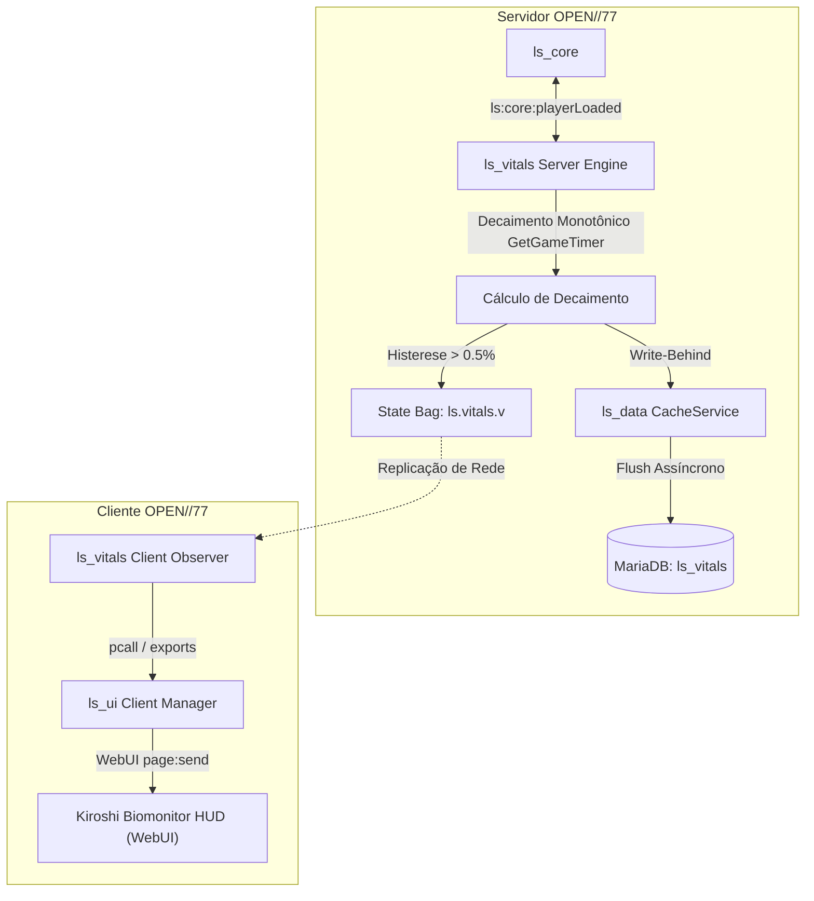

# Relatório de Implementação: Fase 2 (Vitais & HUD Kiroshi)

> **Status:** Concluído e Validado em Servidor Ativo (MariaDB + OPEN//77 Runtime)  
> **Data:** 01/10/2026  
> **Arquiteto:** UEoE 1  

---

## 1. Visão Geral da Entrega

A **Fase 2** estabelece a fisiologia do cidadão em Night City e a sua representação visual diegética no mundo do jogo, respeitando estritamente o **Princípio do Mod Invisível** (paridade estética absoluta com a REDengine 4 / Cyberpunk 2077).



---

## 2. Componentes Criados & Arquivos

### 2.1 Módulo `ls_vitals` (Submódulo Biológico)
* **Manifesto:** [`Server/resources/gamemodes/lifesim/ls_vitals/open77.lua`](file:///c:/Games/VICCS_CyberpunkServer/Server/resources/gamemodes/lifesim/ls_vitals/open77.lua)
  * Sintaxe válida de Lua 5.4 com `auto_start(true)` e supressão de falsos-positivos de globais.
* **Configuração:** [`Server/resources/gamemodes/lifesim/ls_vitals/shared/config.lua`](file:///c:/Games/VICCS_CyberpunkServer/Server/resources/gamemodes/lifesim/ls_vitals/shared/config.lua)
  * Taxas de decaimento por minuto: Fome (`0.50`), Sede (`0.90`), Energia (`0.35`), Higiene (`0.25`), Estresse (`-0.20` recuperação).
  * Multiplicadores de esforço físico (repouso, corrida, sprint, direção).
  * Catálogo de consumíveis calibrado (All-Foods Burrito, Spicy Ramen, NiCola Blue, Spunky Monkey, MaxDoc, etc.).
* **Servidor:** [`Server/resources/gamemodes/lifesim/ls_vitals/server/main.lua`](file:///c:/Games/VICCS_CyberpunkServer/Server/resources/gamemodes/lifesim/ls_vitals/server/main.lua)
  * Aplicação automática de migração SQL `base_ls_vitals_schema_v1`.
  * Registro no `CacheService` do `ls_data` sob o namespace `vitals`.
  * Registro de conformidade no `ls_core` (`registerModule`).
  * Motor de decaimento monotônico com tick de 5000ms via `GetGameTimer()`.
  * Filtro de histerese (0.5% ou 30s de heartbeat) para evitar sobrecarga de rede.
  * Cálculo de decaimento offline na conexão com piso seguro de sobrevivência (`MinHunger = 15.0`).
  * Exports: `getVitals`, `setVitals`, `modifyVitals`, `consumeItem`.
  * Evento de rede: `ls:vitals:consume`.
* **Cliente:** [`Server/resources/gamemodes/lifesim/ls_vitals/client/main.lua`](file:///c:/Games/VICCS_CyberpunkServer/Server/resources/gamemodes/lifesim/ls_vitals/client/main.lua)
  * Observador de State Bag reativo (`Open77.state.onChange`).
  * Despacho automático de telemetria para a HUD `ls_ui`.

### 2.2 Módulo `ls_ui` (Interface Nativa Kiroshi Biomonitor)
* **Manifesto:** [`Server/resources/gamemodes/lifesim/ls_ui/open77.lua`](file:///c:/Games/VICCS_CyberpunkServer/Server/resources/gamemodes/lifesim/ls_ui/open77.lua)
  * Diretiva declarativa `web_ui_page "web/index.html"` e `reload_policy "reconnect"`.
* **Gerenciador Cliente:** [`Server/resources/gamemodes/lifesim/ls_ui/client/main.lua`](file:///c:/Games/VICCS_CyberpunkServer/Server/resources/gamemodes/lifesim/ls_ui/client/main.lua)
  * Instanciação de WebUI em camada `hud` (transparente, 1920x1080 @ 30 FPS).
  * Exports para outros módulos: `push(topic, data)`, `setVisible(state)`, `setFocus(keyboard, cursor)`.
* **Frontend Nativo WebUI:**
  * [`web/open77-ui.css`](file:///c:/Games/VICCS_CyberpunkServer/Server/resources/gamemodes/lifesim/ls_ui/web/open77-ui.css): Tokens de design oficiais OPEN//77 (`--op77-accent: #22d8e2`, `--op77-signal: #ff5964`, `--op77-bg: #080e19`).
  * [`web/app.css`](file:///c:/Games/VICCS_CyberpunkServer/Server/resources/gamemodes/lifesim/ls_ui/web/app.css): Chanfros de 45° Kiroshi (`clip-path: polygon`), cantoneiras táticas (brackets), scanlines CRT, barras de progresso otimizadas por GPU (`transform: scaleX`).
  * [`web/app.js`](file:///c:/Games/VICCS_CyberpunkServer/Server/resources/gamemodes/lifesim/ls_ui/web/app.js): Gerenciador reativo, escuta de eventos nativos do OPEN//77, sintetizador de áudio diegético 100% offline via Web Audio API.
  * [`web/index.html`](file:///c:/Games/VICCS_CyberpunkServer/Server/resources/gamemodes/lifesim/ls_ui/web/index.html): Estrutura semântica do Biomonitor (Nutrição, Hidratação, Stamina, Sanitário e Carga Neural).

---

## 3. Verificação em Banco de Dados e Servidor

1. **Migração SQL Executada:**
   ```sql
   SELECT * FROM ls_schema_migrations;
   ```
   * Retorno: `ls_vitals v1` registrado com checksum `base_ls_vitals_schema_v1`.
2. **Estrutura da Tabela:**
   * Tabela `ls_vitals` criada no MariaDB com colunas `license CHAR(32) PRIMARY KEY`, `data JSON` e chave estrangeira para `ls_players`.
3. **Boot do Servidor:**
   * Log: `[INF] [resource:ls_data] [ls_data:Migrations] Migração ls_vitals v1 aplicada com sucesso.`
   * Log: `[INF] [resource:ls_core] [ls_core:Registry] Módulo registrado com sucesso: 'ls_vitals' (v0.1.0)`.
   * Log: `[INF] [resource:ls_vitals] [ls_vitals] Submódulo biológico e motor de necessidades inicializados.`
