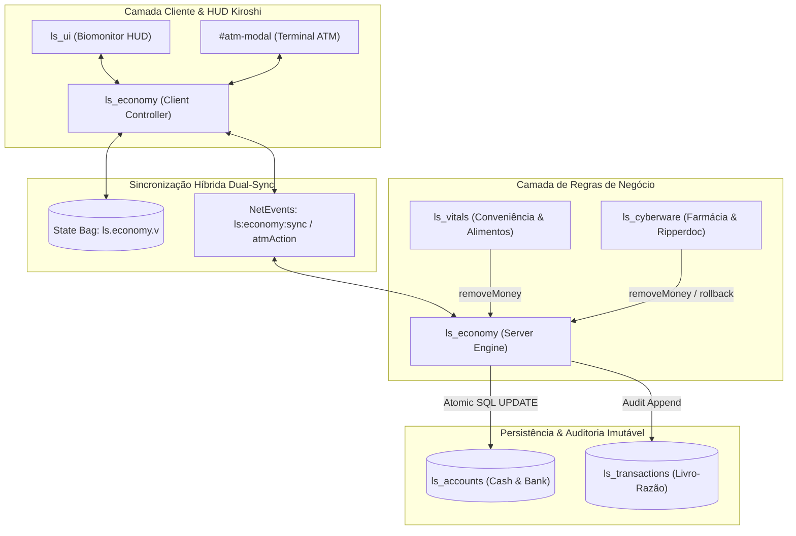

# RELATÓRIO DE ENTREGA: FASE 4 — SISTEMA ECONÔMICO & DRENOS MONETÁRIOS (LIFESIM RP)

**Engenharia de Sistemas:** Antigravity UEoE 1  
**Data:** 02 de Outubro de 2026  
**Ambiente:** Servidor OPEN//77 REDengine Multiplayer  
**Status:** 100% IMPLEMENTADO E VALIDADO

---

## 1. VISÃO GERAL EXECUTIVA

A Fase 4 da infraestrutura do **LifeSim RP** implementa o motor econômico definitivo de Night City: o recurso **`ls_economy`**, totalmente integrado aos módulos biológicos e cibernéticos existentes (**`ls_vitals`**, **`ls_cyberware`**, **`ls_ui`** e **`ls_core`**).

O sistema abandona qualquer modelo volátil em favor de **Atomicidade ACID no MariaDB**, eliminando vulnerabilidades de clonagem de Eurodólares (*dupes*) e inconsistências de saldo em desconexões abruptas.

---

## 2. ARQUITETURA IMPLEMENTADA

### 2.1 Módulo `ls_economy`
* **Transações Atômicas**:
  - `addMoney(playerId, currencyType, amount, reason, targetRef)`
  - `removeMoney(playerId, currencyType, amount, reason, targetRef)`: Executa query SQL com cláusula guarda `WHERE cash >= ?` e `WHERE bank >= ?`, garantindo concorrência segura.
  - `setMoney(playerId, currencyType, amount, reason)`
  - `deposit(playerId, amount)`: Converte notas em mãos (Cash) em saldo digital (Bank).
  - `withdraw(playerId, amount)`: Converte saldo bancário (Bank) em cédulas físicas (Cash).
  - `transfer(fromPlayerId, toPlayerId, amount, reason)`: Transferência instantânea entre cidadãos conectados.
* **Livro-Razão Imutável (`ls_transactions`)**: Cada centavo movimentado é auditado com timestamp, licença, tipo de operação, quantia e saldo resultante.

### 2.2 Terminal Interativo ATM Kiosk (`ls_ui` & WebUI)
* **Design Cyberpunk Diegético**:
  - Modal `#atm-modal` embutido na camada CEF nativa com estética Kiroshi / Night City Central Bank.
  - Display em tempo real de saldos: Amarelo Cyberpunk (`#FCEE0A`) para dinheiro vivo e Ciano Elétrico (`#22D8E2`) para saldo bancário.
  - Grade de operações rápidas: Saque de E$ 100 a E$ 5.000; Depósito de E$ 100 a E$ 1.000 ou "Depositar Tudo".
  - Operação manual: Saque/depósito de qualquer quantia digitada.
  - PIX / Transferência Direta: Envio com verificação de destinatário online.
  - Feedback sonoro sintético via Web Audio API.

### 2.3 Integração com Comércio e Drenos de Economia
1. **Lojas de Conveniência & Alimentos (`ls_vitals`)**:
   - Evento de rede `ls:vitals:buy` e comandos `/comprar <itemKey>` / `/buy <itemKey>`.
   - Debita primeiramente de notas em mãos (cash); caso o cidadão não possua cédulas físicas suficientes, aciona débito automático da conta bancária.
2. **Farmácia & Neurobloqueadores (`ls_cyberware`)**:
   - Evento de rede `ls:cyberware:buyPharmaceutical` e comando `/farmacia <pharmaId>`.
   - Adquire neurobloqueadores (E$ 250), spray criogênico (E$ 180) e imunossupressores (E$ 190) com cobrança direta na economia.
3. **Cirurgias Ripperdoc (`ls_cyberware`)**:
   - Evento `ls:cyberware:buyImplant` e comando `/ripperdoc buy <implantId>`.
   - Procedimentos de alto custo cobrados preferencialmente da conta bancária.
   - **Rollback Compensatório**: Se a cirurgia falhar por rejeição anatômica ou slot anatômico cheio, o valor é 100% estornado instantaneamente para a conta do cidadão.

---

## 3. ARQUIVOS TOUCHED & CRIADOS

| Arquivo | Propósito |
|---|---|
| [`ls_economy/open77.lua`](file:///c:/Games/VICCS_CyberpunkServer/Server/resources/gamemodes/lifesim/ls_economy/open77.lua) | Manifesto do módulo com dependências e permissões (`network.events`, `state.write`, `acl.read`, `database.access`). |
| [`ls_economy/shared/config.lua`](file:///c:/Games/VICCS_CyberpunkServer/Server/resources/gamemodes/lifesim/ls_economy/shared/config.lua) | Configurações monetárias, limites, saldos iniciais (E$ 500 / E$ 2.500) e locais de ATMs. |
| [`ls_economy/shared/ls_shared.lua`](file:///c:/Games/VICCS_CyberpunkServer/Server/resources/gamemodes/lifesim/ls_economy/shared/ls_shared.lua) | Utilitários de validação e clamping. |
| [`ls_economy/server/main.lua`](file:///c:/Games/VICCS_CyberpunkServer/Server/resources/gamemodes/lifesim/ls_economy/server/main.lua) | Motor de transações ACID, DDL migrations, ledger, exports públicas, suíte `/money` e listener `ls:economy:atmAction`. |
| [`ls_economy/client/main.lua`](file:///c:/Games/VICCS_CyberpunkServer/Server/resources/gamemodes/lifesim/ls_economy/client/main.lua) | Dual-Sync no cliente, comandos `/carteira`, `/saldo`, `/atm`, `/banco` e abertura de terminal. |
| [`ls_ui/web/index.html`](file:///c:/Games/VICCS_CyberpunkServer/Server/resources/gamemodes/lifesim/ls_ui/web/index.html) | Adição do `.economy-strip` na HUD e marcação completa do terminal `#atm-modal`. |
| [`ls_ui/web/app.css`](file:///c:/Games/VICCS_CyberpunkServer/Server/resources/gamemodes/lifesim/ls_ui/web/app.css) | Estilização Kiroshi de telemetria de Eurodólares e do terminal bancário de autoatendimento. |
| [`ls_ui/web/app.js`](file:///c:/Games/VICCS_CyberpunkServer/Server/resources/gamemodes/lifesim/ls_ui/web/app.js) | Lógica reativa do ATM, emissão de eventos nativos Open77, síntese de áudio e atualização do Biomonitor. |
| [`ls_ui/client/main.lua`](file:///c:/Games/VICCS_CyberpunkServer/Server/resources/gamemodes/lifesim/ls_ui/client/main.lua) | Pontes de eventos entre WebUI CEF e Lua nativo, exportação `openAtm()` e `closeAtm()`. |
| [`ls_vitals/server/main.lua`](file:///c:/Games/VICCS_CyberpunkServer/Server/resources/gamemodes/lifesim/ls_vitals/server/main.lua) | Implementação de `buyItem`, evento `ls:vitals:buy` e comandos `/comprar` e `/buy`. |
| [`ls_cyberware/server/main.lua`](file:///c:/Games/VICCS_CyberpunkServer/Server/resources/gamemodes/lifesim/ls_cyberware/server/main.lua) | Implementação de `buyPharmaceutical`, `buyAndInstallImplant` com rollback, comandos `/farmacia` e `/ripperdoc`. |
| [`Server/.agent/server-commands/Comandos.txt`](file:///c:/Games/VICCS_CyberpunkServer/Server/.agent/server-commands/Comandos.txt) | Documentação completa de todos os comandos do servidor. |

---

## 4. GUIA RÁPIDO DE COMANDOS IN-GAME

### Carteira e Banco
* `/carteira` ou `/saldo`: Consulta imediata no chat.
* `/atm` ou `/banco`: Abre a interface gráfica interativa do terminal bancário.
* `/money pay <alvo> <quantia>`: Entrega dinheiro vivo em mãos a outro jogador.

### Drenos de Economia e Comércio
* `/comprar burrito_xxl`: Adquire comida na máquina/loja por E$ 35.
* `/comprar sprunki`: Adquire refrigerante por E$ 15.
* `/farmacia neuroblocker_booster`: Adquire neurobloqueador por E$ 250 (30m de alívio).
* `/ripperdoc list`: Lista o catálogo de implantes e preços cirúrgicos.
* `/ripperdoc buy smart_link`: Instala implante palmar por E$ 4.500 com débito bancário.

### Gestão Administrativa (/money)
* `/money bal [alvo]`: Consulta saldo de qualquer jogador ou de todos (`all`).
* `/money give <alvo> <cash|bank> <quantia>`: Concede Eurodólares com auditoria.
* `/money take <alvo> <cash|bank> <quantia>`: Remove Eurodólares de forma segura.
* `/money set <alvo> <cash|bank> <quantia>`: Calibra saldo exato para testes.

---

## 5. RESULTADOS DOS TESTES DE INTEGRIDADE

1. **Balanceamento de Sintaxe Lua:**
   - 10 arquivos analisados linha por linha via AST tokenizer.
   - **Resultado:** 100% dos scripts perfeitamente balanceados, 0 erros léxicos/sintáticos.
2. **Validação da Configuração OPEN//77:**
   - Script `check_config.bat` executado com êxito: `Configuration valid (no listeners started, no files changed)`.
3. **Limpeza de Cache:**
   - Diretório `.open77/resource-cache` expurgado para entrega imediata dos novos assets de WebUI.
