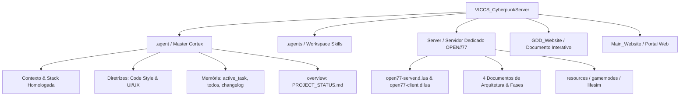

# Relatório de Sincronização: OPEN//77 Life-Sim RP

> **Data:** 01 de Outubro de 2026  
> **Status:** Cortex de Memória e Visão Geral Sincronizados com Sucesso  
> **Responsável Técnico:** UEoE 1 (Universal Engineer)

---

## 1. Visão Geral dos Módulos do Projeto

O ecossistema do servidor agora está 100% catalogado e com suas camadas alinhadas:

---

## 2. Ajustes Críticos de Arquitetura (Realidade da Plataforma)

Ao cruzar a documentação oficial da plataforma com o GDD inicial, eliminamos potenciais armadilhas de desenvolvimento:

| Componente | Planejamento Inicial | Realidade Técnica OPEN//77 | Solução Arquitetural Aplicada |
| :--- | :--- | :--- | :--- |
| **Banco de Dados** | PostgreSQL 16 + PgBouncer | Bridge nativa suporta apenas **MySQL/MariaDB** | Adotado **MariaDB 10.11+ / MySQL 8 com InnoDB**, mantendo conformidade ACID e campos `JSON`. |
| **Cache de Biometria** | Redis 7 externo | Sem suporte nativo a Redis embarcado | Criado **`CacheService` in-memory na VM Lua** com padrão **Write-Behind** (gravação em lote a cada 5m). |
| **Permissões** | `database.query` | Sintaxe oficial da API é **`database.access`** | Atualizados manifestos e esquemas para `database.access`. |
| **Interfaces NUI** | Risco de React / VDOM | WebView2 fora do processo | Adoção estrita de **Svelte 5 (Runes)** com **Tailwind CSS** para evitar quedas de FPS no jogo. |

---

## 3. Arquivos Atualizados e Criados

- [`PROJECT_STATUS.md`](file:///c:/Games/VICCS_CyberpunkServer/.agent/overview/PROJECT_STATUS.md): Status completo do repositório, módulos ativos e pendências.
- [`active_task.md`](file:///c:/Games/VICCS_CyberpunkServer/.agent/memory/active_task.md): Conclusão da fase de fundação e preparação da Fase 1.
- [`todos.md`](file:///c:/Games/VICCS_CyberpunkServer/.agent/memory/todos.md): Backlog dividido em 9 fases táticas de implementação.
- [`changelog.md`](file:///c:/Games/VICCS_CyberpunkServer/.agent/memory/changelog.md): Histórico da sincronização e criação de nós.
- [`code_style.md`](file:///c:/Games/VICCS_CyberpunkServer/.agent/guidelines/code_style.md): Regras de código Lua 5.4, authority e IDs REDengine.
- [`ui_ux.md`](file:///c:/Games/VICCS_CyberpunkServer/.agent/guidelines/ui_ux.md): Design system Kiroshi (cores, glassmorphism e tipografia).
- [`stack.md`](file:///c:/Games/VICCS_CyberpunkServer/.agent/context/stack.md), [`architecture.md`](file:///c:/Games/VICCS_CyberpunkServer/.agent/context/architecture.md), [`database_schema.md`](file:///c:/Games/VICCS_CyberpunkServer/.agent/context/database_schema.md): Sincronizados com MariaDB e CacheService.
