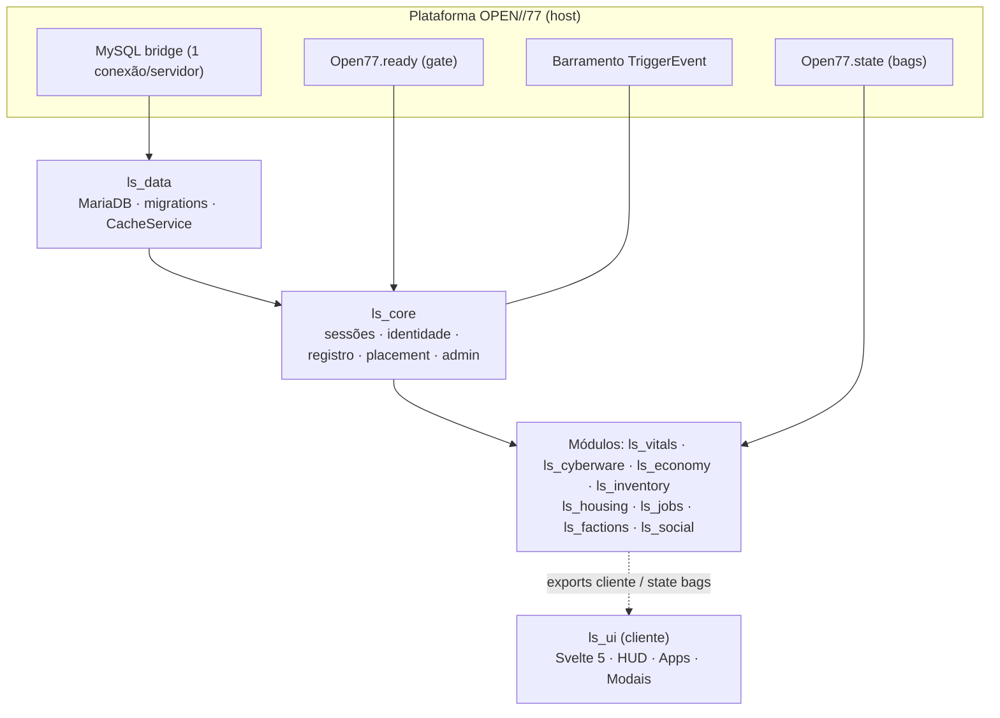

# LIFESIM CORE — Contexto Mestre para IDE & Agente de IA

> **Projeto:** OPEN//77 Night City Life-Sim RP · gamemode `lifesim`
> **Recurso-coração:** `ls_core` (identidade, sessões, barramento, registro de módulos) + `ls_data` (MariaDB, migrations, cache)
> **Plataforma:** OPEN//77 **ALPHA** (server `2.31.21+op77.121`) · Lua **5.4.8** (sandbox) · MariaDB · Svelte 5 na WebUI
> **Versão deste documento:** 0.1.0 · 2026-10-01
> **Hierarquia de verdade:** (1) documentação oficial OPEN//77 → (2) este arquivo → (3) `lifesim_master_implementation_plan.md` → (4) GDD.
> Se este arquivo divergir da documentação oficial, **a documentação vence**; corrija este arquivo.

Sugestão de caminho no repositório: `.agent/context/00_LIFESIM_CORE.md` (e referencie-o a partir do `AGENTS.md` / regras da IDE).

---

## 0. Como o agente deve usar este arquivo

1. **Leia as seções 1, 4 e 7 antes de escrever qualquer código.** São as que evitam 90% dos bugs.
2. **Nunca invente uma API do OPEN//77.** Se a função não está listada aqui nem na doc, pesquise antes (§2). Se não for possível verificar, escreva `-- VERIFY(<url>)` no código e registre em `docs/OPEN_QUESTIONS.md`.
3. **Todo recurso novo é um módulo do core.** Ele se registra (§7.2), usa os canais de comunicação certos (§5.3) e segue as convenções (§6). Recurso que não passa pelo core é um recurso perdido.
4. **Toda export/evento/state-bag nova entra em `docs/CONTRACTS.md`** no mesmo commit. O contrato é o único mecanismo que mantém o ecossistema convergente.
5. **O servidor decide; o cliente apenas pede e desenha.**
6. Em caso de conflito entre "o plano mestre diz X" e "a documentação diz Y", siga a §4 (correções já mapeadas) e, se for um caso novo, **pare e pergunte ao humano**.

---

## 1. Regras de ouro (TL;DR)

| # | Regra | Por quê |
|---|-------|---------|
| R1 | Server-authoritative. Todo valor vindo do cliente é *dica*; re-derive no servidor. | `source` é confiável; payload não. |
| R2 | `playerId`/`source` = inteiro de sessão → **`tonumber` nos eventos do host** (chegam como string). **IDs de entidade REDengine = opacos, nunca `tonumber`.** | Chaves de tabela divergem silenciosamente. |
| R3 | Persistência por **`license`** (GUID da conta, 32 hex sem hífens), nunca por `playerId`. `userId` é guardado como coluna secundária. | `playerId` é reciclado a cada reconexão. |
| R4 | **Sem `os`, `io`, `require`, `load`, `debug`, `collectgarbage` no servidor.** Tempo: `Open77.time.unix()` / `Open77.time.monotonic()` / `GetGameTimer()`. | Sandbox: `os.time()` levanta erro. |
| R5 | Não mexer em um jogador (teleport/spawn/kill/respawn) antes de `Open77.ready.isReady(playerId)` **e** `Open77.players.getLifeState(playerId) ~= nil`. | Teleportar jogador não-encarnado **crasha o cliente**. |
| R6 | Mover jogador vivo só com `Open77.players.teleport(...)`. Nunca escrita de transform. | Atravessa o chão não carregado. |
| R7 | **Um gamemode por servidor.** Remover/desabilitar `freeroam` (`forceOnJoin`/`autoRespawn` brigam com o nosso spawn). | Sintoma: "o jogador volta para outro lugar 1s depois". |
| R8 | **Dinheiro nunca passa por cache nem por state bag.** Sempre MariaDB, síncrono, idempotente. | Duplicação/perda; state bags são visíveis a outros jogadores. |
| R9 | State bags: pequenos, não-secretos, cliente nunca escreve. Limites: 64 chaves/bag, 4 KiB/valor, 16 KiB/bag. | Orçamento é **compartilhado** por todos os módulos (§7.4). |
| R10 | Banco é **um só** para o servidor inteiro, sem isolamento por resource. Toda tabela começa com `ls_`; só o módulo dono escreve nela. | Doc oficial: "treat the shared database as shared". |
| R11 | Scripts listados **explicitamente** no manifesto, um por linha. **Nunca** `client/**/*.lua`. | `**` não casa `client/main.lua` → **ninguém conecta**. |
| R12 | `TriggerEvent` não propaga `source`. Passe `playerId` como **argumento**. | Evento do barramento não carrega identidade. |
| R13 | Nada de decisão em "uma amostra de posição". Regras = "mantido por N segundos" num tick fixo; posição ilegível **congela** o acumulador. | Posição é snapshot replicado, não leitura viva. |
| R14 | Export *síncrono* não pode `Wait`/`await`/usar `MySQL.*.await`. Export *assíncrono* tem timeout de 30 s e **não desfaz escritas**. | Desenhe retries idempotentes. |
| R15 | **Paridade Estética Nativa Cyberpunk 2077 (1:1 REDengine 4).** Toda NUI, WebUI, HUD e modal deve ser visualmente indistinguível da UI nativa do jogo vanilla. Sem cara de "mod" ou web genérica. | O jogador nunca deve perceber quebra de imersão entre menus do jogo e recursos do servidor (§10.3). |

---

## 2. Fontes de verdade (documentação oficial)

> A plataforma está em **ALPHA**: APIs mudam. Antes de implementar algo "grande", reconfira a página e o `devblog`.
> Para agentes/LLMs: cada página tem versão Markdown (`<url>.md`), além de `llms.txt` e `llms-full.txt`.

| Tema | URL |
|------|-----|
| Índice | https://open2077.net/docs |
| API Lua do servidor (completa) | https://open2077.net/docs/server-api |
| Runtime Lua / manifesto / quotas | https://open2077.net/docs/resource-runtime |
| Escrevendo um gamemode | https://open2077.net/docs/writing-a-gamemode |
| Kernel de gamemode / serviços | https://open2077.net/docs/gamemode-kernel |
| Exports entre resources (servidor) | https://open2077.net/docs/server-exports |
| State bags | https://open2077.net/docs/state-bags |
| Callbacks de rede | https://open2077.net/docs/callbacks |
| Readiness gate (join) | https://open2077.net/docs/readiness-gate |
| Identidade | https://open2077.net/docs/identity |
| Controle de conexão | https://open2077.net/docs/connection-control |
| Comandos & ACL | https://open2077.net/docs/server-acl |
| Banco SQL | https://open2077.net/docs/database |
| Tunables (config ao vivo no Warden) | https://open2077.net/docs/tunables |
| Teleporte / viagem | https://open2077.net/docs/travel |
| Voz | https://open2077.net/docs/voice |
| Elevadores / portas | https://open2077.net/docs/elevators · https://open2077.net/docs/doors |
| Zonas / PolyZone | https://open2077.net/docs/zones · https://open2077.net/docs/polyzone |
| WebUI / UI kit / notificações | https://open2077.net/docs/ui-kit · https://open2077.net/docs/notifications |
| Cyberware | https://open2077.net/docs/cyberware |
| Construindo com agente de IA | https://open2077.net/docs/agents |
| Teste autônomo | https://open2077.net/docs/agent-testing |
| Changelog | https://open2077.net/devblog |

---

## 3. Fatos verificados da plataforma

### 3.1 Runtime e sandbox (servidor)

- **PUC Lua 5.4.8**, **uma VM por resource** (estado, scheduler, memória, permissões e ciclo de vida próprios). Globais não são compartilhados entre resources.
- Disponíveis: `math`, `string`, `table`, `utf8`, `coroutine`, `json`, `print`, `CreateThread`, `Wait`, `SetTimeout`, `GetGameTimer`, e o namespace `Open77.*`.
- **Ausentes (são `nil`):** `os`, `io`, `debug`, `package`, `require`, `load`, `loadfile`, `dofile`, `collectgarbage`.
- Dividir código = mais linhas `server_script`/`shared_script` no manifesto; **a ordem do manifesto é a ordem de execução** (liste o arquivo que publica a tabela antes de quem a consome).
- Quotas por resource (servidor): **1.024 tasks agendadas**, **2.048 handlers**; limite de instruções por *resume* e de memória da VM. Estourar o orçamento de instruções levanta erro que **encerra a coroutine** (`while true do ... Wait(n) end` nunca mais retoma). Desconfie do orçamento antes da lógica quando um loop "morre calado".
- Eventos de rede: máx. 32 argumentos / envelope JSON de 48 KiB; transporte desconecta a sessão na **33ª** net-event recebida em 1 s.
- Manifesto `open77.lua` é um **DSL declarativo, não Lua** (`auto_start true` é válido ali e inválido em `.lua`). Não passe o manifesto por `luac`.

### 3.2 Compartilhar código **sem** `require`

Não existe `require` no servidor, e um manifesto não pode apontar para arquivos fora do seu resource. Portanto:

- **Lógica pura reutilizável** (helpers, matemática, validação): manter uma fonte canônica em `lifesim/_shared/` e **copiar** para `shared/` de cada resource com `scripts/sync-shared.ps1` (arquivos marcados `-- GENERATED, DO NOT EDIT`). Funciona nos dois hosts.
- **Serviços com estado**: export (§5.3).
- Dentro de **um** resource, arquivos compartilham a mesma VM: publique uma tabela global (ex.: `Core = { ... }` no fim de `main.lua`) e liste `main.lua` antes dos demais.

### 3.3 Canais entre resources (servidor)

| Canal | API | Natureza | Limites / pegadinhas |
|-------|-----|----------|----------------------|
| **Export assíncrono** | `exports(name, fn)` + `Open77.exports.call(res, name, ...)` → Promise → `:await()` | Request/response, copiado por valor | 30 s de timeout; 32 valores, profundidade 16, 4.096 nós, 48 KiB; **não chamar em escopo de arquivo** (`resource_preparing`); `await` só em `CreateThread`/handler/comando |
| **Export síncrono** | `exports.<res>:<name>(...)`, `exports['res-x']:name()`, `Open77.exports.callSync` | Chamada inline, **levanta erro** em falha (use `pcall`) | Callee **não pode** `Wait`/`await`/`MySQL.*.await` (`export_yielded`); recursão máx. 8 |
| **Evento no barramento** | `TriggerEvent(name, ...)` / `AddEventHandler` | Broadcast fire-and-forget, host-wide, entregue no próximo tick, por valor | **Não** propaga `source`; nomes reservados (App. A); handlers podem `Wait` |
| **Evento local** | `TriggerLocalEvent` | Só a VM atual | Para desacoplar dentro do mesmo resource |
| **State bag** | `Open77.state.player(id):set(k, v)` (requer `state.write`) | Estado replicado servidor→clientes | Cliente **nunca** escreve (só `request` validado); App. B |
| **Callback cliente→servidor** | `Open77.net.register(name, fn(source, ...))` / `Open77.net.callAwait(...)` | Request/response de rede | Requer `network.events`; **re-validar** distância, posse, permissão, formato |

Identidade em export: `GetInvokingResource()` e `GetInvokingResourceGeneration()` identificam o *chamador imediato* só dentro da coroutine do export. **Nunca aceite "owner" como argumento** (permitiria personificar outro resource). Uma dependência declarada controla **ordem de start e propagação de stop, não autorização**: qualquer resource rodando pode tentar chamar seu export.

### 3.4 Identidade

| Valor | Vida | Uso |
|-------|------|-----|
| `license` (via `Open77.players.identifiers(id).license`, desde `2.31.13+op77.101`) | Permanente (conta) | **Chave de persistência do lifesim** |
| `userId` (`Open77.players.identifier(id)` / `identifiers(id).userId`) | Durável (instalação) | Chave de ACL runtime (`Open77.acl.*` recebe `userId`) e coluna auxiliar |
| `playerId` / `source` | Uma conexão | Endereçar o jogador **agora** |
| `displayName` | Editável | Só apresentação |

`identifiers(id).license` pode faltar (`identifier_not_linked`): trate como erro de admissão, não crie perfil com chave vazia.

### 3.5 Eventos de jogador (servidor)

`onPlayerConnecting(player, deferrals)` (gate; permissão `players.gate`) → `playerJoining` (FiveM, `source` = novo id) / `onPlayerConnected(playerId, name)` → *(gate de prontidão)* → `onPlayerReady(playerId, detail)` → … → `onPlayerDisconnected(playerId, reason)` + `playerDropped(reason)` (mesmo tick; use **só um**). Todos os eventos do host trazem `playerId` como **string**.

`onPlayerReady` é a **barreira levantando, não um gatilho**: não diz que o mundo do jogador está de pé. Mantenha seu próprio sinal de "cliente pronto" e *peça permissão* ao gate (`Open77.ready.isReady`). O gate também pode abrir por **timeout** (`detail = "timeout:<resource>"`) com o jogador ainda em modal e sem avatar: cheque `Open77.players.getLifeState(playerId)`; se for `nil`, não coloque o jogador.

---

## 4. Correções ao Plano Mestre (plano × documentação)

O plano mestre está correto na visão; estes pontos **precisam** ser ajustados na implementação:

| # | Plano diz | Documentação oficial diz | Ação |
|---|-----------|--------------------------|------|
| C1 | Evento `Open77:playerLoaded` / `playerJoining` | Os eventos do host são `onPlayerConnected`, `onPlayerReady`, `onPlayerDisconnected` (+ `playerJoining`/`playerDropped` como alias FiveM). `Open77:playerLoaded` não consta. | Usar §3.5. O "playerLoaded" do lifesim é **nosso**: `ls:core:playerLoaded` (§7.3). |
| C2 | Decaimento via `os.time()` | `os` não existe. | `GetGameTimer()` (ms, monotônico) para tick; `Open77.time.unix()` para wall-clock (decaimento offline). |
| C3 | `Player(src).state:set("loaded", true, true)` | Existe shim FiveM, mas não há 3º argumento; escrita exige permissão `state.write`; forma nativa: `Open77.state.player(id):set(k, v)`. | Usar forma nativa e chaves com namespace `ls.*` (§7.4). |
| C4 | `Open77.players.setRoutingBucket(playerId, bucketId)` | A doc mostra `Open77.routingBuckets.setPlayer(playerId, bucket)`, `setPopulationEnabled`, `setLockdownMode`; e `Open77.players.teleport(..., { bucket = })` muda o bucket *antes* do move. | Para entrar/sair de casa: `teleport` com `bucket`. `VERIFY(server-api#routing-buckets)` o nome exato do wrapper e a permissão. |
| C5 | `SendNUIMessage` (NUI) | No OPEN//77 a WebUI usa `WebUI.create{...}` / `page:send(event, payload)` / `page:on` e, no JS, `window.Open77.on/emit/invoke/ready()`. | Reescrever o contrato do `ls_ui` (§10). |
| C6 | Tabelas `players`, `inventories` | Banco é compartilhado por todos os resources com `database.access`; sem schema por resource. | Renomear: `ls_players`, `ls_inventories` (demais já têm `ls_`). |
| C7 | Chave de persistência `license` | Correto para conta (desde `op77.101`). A página "Identity" ainda recomenda `userId`. | Manter `license` como PK; gravar `user_id` ao lado. |
| C8 | `MySQL.query.await` / `MySQL.insert.await` | A doc exibe `MySQL.ready`, `MySQL.isReady`, `MySQL.scalar.await`, `MySQL.update.await`; transações/`query`/`insert` constam em `server-api#database`. | `VERIFY(server-api#database)` assinaturas, e **como obter transação com `FOR UPDATE`** (§9.3). |
| C9 | Flush em `playerDropped` / `onResourceStop` | `onPlayerDisconnected`/`playerDropped` chegam no mesmo tick (não sequenciar entre os dois). `onResourceStop(name, reason)` roda na VM que ainda executa código, mas escritas assíncronas durante stop **podem ser recusadas**. | Escolher **um** evento de saída; cache mapeia `playerId→license` no connect (identificadores podem sumir após o drop). `VERIFY` flush com `MySQL.update.await` dentro de `onResourceStop`. |
| C10 | Fonte do `ls_core` carrega tudo com `require`-like | Sem `require` no servidor. | §3.2. |
| C11 | `Open77.elevators.goTo`, `open-voice`, PolyZone no servidor | Não confirmados nesta revisão. | `VERIFY` em `/docs/elevators`, `/docs/voice`, `/docs/polyzone` antes da Fase 5/7. |
| C12 | `ls_data` + `ls_core` lado a lado | `ls_core` precisa do banco para criar o perfil. | `ls_data` sobe **antes**; `ls_core` declara `dependency "ls_data"`. |

### 4.1 Decisões de design propostas pelo Core (ADR resumido)

> Tratar como **aceitas** até o humano objetar. Cada uma resolve um problema real de convergência.

| ID | Decisão | Motivo |
|----|---------|--------|
| D-01 | `ls_core` é o **único** dono de sessão/identidade/barramento/registro de módulos. | Uma fonte de verdade para "quem é o jogador". |
| D-02 | Módulos **se registram** no core (`registerModule`) declarando versão, dependências, exports, eventos, chaves de state bag e tabelas. | O core sabe o que existe; o agente consulta o registro e o `CONTRACTS.md`. |
| D-03 | `ls_data` expõe **migrations por módulo** (registradas por export, com checagem de prefixo `ls_` e checksum) e **namespaces de cache declarativos** (tabela + coluna JSON), em vez de funções de persistência por módulo. | Funções não cruzam VMs; SQL declarativo é auditável. |
| D-04 | Cache é fonte de verdade **em runtime** para dados não-financeiros; módulos escrevem nele **de forma síncrona** (export síncrono, só memória); o flush apenas persiste. | Elimina corrida entre "evento de saída" e "último write". |
| D-05 | Saldo financeiro vive em `ls_accounts` (dono: `ls_economy`), fora de `ls_players`. | `ls_core` não conhece dinheiro. |
| D-06 | Eventos do barramento: `ls:<modulo>:<verbo>`; exports: `camelCase`; state keys: `ls.<modulo>.<chave>`. | Namespaces sem colisão com os nomes reservados da plataforma. |
| D-07 | Convenção de retorno: `valor` ou `nil, "<razao_snake_case>"` (idêntica à da plataforma). | Caller trata todos os módulos igual. |
| D-08 | `ls_ui` é o **único** dono das páginas WebUI do lifesim; módulos clientes empurram dados via export cliente. | Um bundle Svelte, um tema, um ciclo de reload (`reload_policy "reconnect"`). |

---

## 5. Arquitetura

### 5.1 Camadas e dependências



Regras de dependência (manifesto `dependency`):

- `ls_data` → *(nenhuma do lifesim)*
- `ls_core` → `ls_data`
- `ls_<módulo>` → `ls_core` (+ `ls_data` se persiste; + `ls_economy`/`ls_inventory` se consome)
- `ls_ui` → `ls_core`, `open77_notifications`
- **Sem ciclos.** Se dois módulos precisam um do outro, a funcionalidade comum vai para o core ou vira evento no barramento.

### 5.2 O que o core **é** e **não é**

| `ls_core` é | `ls_core` NÃO é |
|-------------|-----------------|
| Sessão/identidade/estado de carga do jogador | Dono de dinheiro, itens, vitais etc. |
| Barramento de eventos `ls:*` e convenções | Lugar para regra de gameplay |
| Registro de módulos, saúde, versões | Camada de SQL (isso é `ls_data`) |
| Primitiva de *placement* (teleport seguro + bucket) | Dono da UI (isso é `ls_ui`) |
| Gate de admissão e de prontidão | Substituto da ACL da plataforma |
| Comandos de diagnóstico/admin (`ls.*`) | |

### 5.3 Qual canal usar (árvore de decisão)

1. *Preciso de uma resposta de outro resource e a resposta cabe em memória?* → **export síncrono** (ex.: `cacheGet`, `getSession`).
2. *A resposta exige banco/espera?* → **export assíncrono** + `:await()` em thread.
3. *Estou avisando "algo aconteceu" sem esperar resposta?* → **evento `ls:*`** (passe `playerId` como argumento).
4. *O cliente precisa **ler** um valor pequeno e não-secreto continuamente?* → **state bag** `ls.*`.
5. *O cliente precisa **pedir** algo ao servidor?* → **callback** `Open77.net.call` (validar tudo) — nunca escrever bag.
6. *O servidor precisa de uma decisão do jogador (confirmar compra)?* → `Open77.net.callClientAwait` com timeout, e **re-validar após o await**.

---

## 6. Convenções

| Item | Padrão | Exemplo |
|------|--------|---------|
| Resource | `ls_<modulo>` | `ls_vitals` |
| Tabela | `ls_<nome>`; dono único declarado no registro | `ls_ledger` (dono `ls_economy`) |
| Evento do barramento | `ls:<modulo>:<verbo>` | `ls:core:playerLoaded` |
| Net event / callback | `ls:<modulo>:<verbo>` (callbacks são por-resource) | `ls:vitals:consume` |
| Export | `camelCase` | `exports.ls_core:getSession(id)` |
| State key | `ls.<modulo>.<chave>` (regex `[A-Za-z][A-Za-z0-9_.-]*`, ≤ 64 bytes) | `ls.vitals.v` |
| Razão de erro | `snake_case`, prefixo do módulo quando específico | `economy_insufficient_funds` |
| Comando | `ls.<modulo>.<acao>`, **restrito** (`RegisterCommand(n, h, true)`) | `ls.core.status` |
| Permissão ACL | `command.ls.*`, `job.<x>.*` | `command.ls.core.status` |
| Logs | `Open77.log.info("[ls_vitals] ...")` | |
| Versão | SemVer no manifesto + `registerModule` | `0.1.0` |

Tunables (valores que o dono do servidor ajusta ao vivo no Warden): a **tabela de declaração** fica em `shared/config.lua` (dados puros), e `Open77.tunables.declare` é chamado **só no servidor** (declarar em `shared_script` faz todo cliente falhar o resource set). Leia o proxy **no ponto de uso**; guardar em `local` de escopo de arquivo congela o valor. Se dois "rounds"/instâncias concorrem, use `capture()`.

---

## 7. Contrato do Core v0.1

> Esta seção **é** a interface pública. Mudou algo aqui → atualize `docs/CONTRACTS.md` e suba a versão do `ls_core`.

### 7.1 Exports de `ls_core`

| Export | Tipo | Assinatura | Retorno |
|--------|------|------------|---------|
| `getSession` | sync | `(playerId)` | `{ playerId, license, userId, name, state, loadedAtMs }` ou `nil, "session_not_found"` |
| `getPlayerIdByLicense` | sync | `(license)` | `playerId` ou `nil` |
| `isLoaded` | sync | `(playerId)` | `boolean` |
| `listSessions` | sync | `()` | array de sessões carregadas |
| `registerModule` | sync | `(descriptor)` (§7.2) | `true` ou `nil, razao` — **owner = `GetInvokingResource()`** |
| `getModule` / `listModules` | sync | `(name)` / `()` | descritor / array |
| `place` | async | `(playerId, position, { heading?, bucket?, fade? })` | resultado do `teleport` ou `nil, razao` — única porta de entrada de movimentação do lifesim |
| `assignBucket` / `releaseBucket` | sync | `(kind, ownerKey)` / `(bucket)` | bucket do pool ou `nil, "bucket_pool_exhausted"` |
| `emit` | sync | `(event, ...)` | valida prefixo `ls:`, delega a `TriggerEvent` |

Autorização: `registerModule`, `place`, `assignBucket`, `releaseBucket` só aceitam chamadores cujo `GetInvokingResource()` comece com `ls_` **e** esteja registrado; guarde `{ nome, generation }` e varra o dono quando `Open77.resource.generation(nome)` mudar (reload/stop).

### 7.2 Descritor de módulo

```lua
exports.ls_core:registerModule({
  version  = "0.1.0",
  requires = { "ls_core", "ls_data" },                -- dependências lógicas
  provides = { exports = { "consume", "get" } },      -- exports públicos
  emits    = { "ls:vitals:changed", "ls:vitals:critical" },
  listens  = { "ls:core:playerLoaded", "ls:core:playerDropped" },
  stateKeys = { ["ls.vitals.v"] = { maxBytes = 512 } },   -- orçamento de bag (§7.4)
  tables   = { "ls_vitals" },                         -- dono declarado
  tunables = { "vitals.decay.hunger" },
})
```

Registre-se em `onResourceStart` (nunca em escopo de arquivo). **Se o `ls_core` reiniciar, o registro some**: todo módulo escuta `open77:resource:started` (nome do resource = `ls_core`) e `ls:core:ready` e **se registra de novo**.

### 7.3 Eventos do core (barramento)

| Evento | Argumentos | Quando |
|--------|-----------|--------|
| `ls:core:ready` | `(version)` | Banco pronto + migrations aplicadas + core de pé |
| `ls:core:moduleRegistered` | `(name, version)` | Módulo registrou-se |
| `ls:core:playerLoaded` | `(playerId, license)` | Perfil em cache **e** gate aberto **e** jogador encarnado |
| `ls:core:playerUnloading` | `(playerId, license, reason)` | Jogador saiu; cache ainda íntegro |
| `ls:core:playerDropped` | `(playerId, license, reason)` | Sessão removida |
| `ls:core:moduleDown` | `(name, reason)` | Módulo parou/recarregou |

Consumidores recebem `playerId` como **número** (o core converte) — mas **eventos do host** (`onPlayer*`) continuam string: converta no handler.

### 7.4 State bags: orçamento compartilhado

Uma bag de jogador tem **64 chaves / 16 KiB** no total, para *todos* os módulos do lifesim **mais** pacotes oficiais (appearance etc.). Regra do core:

- Máx. **6 chaves** e **2 KiB** por módulo; o descritor declara `stateKeys` e o core recusa o excedente.
- Agregue vários campos num único valor (`ls.vitals.v = { hu, th, en, hy, st }` com inteiros 0–100) e escreva **só com histerese** (≥ 0,5 %). Dez escritas na mesma chave no mesmo tick viram um delta.
- A bag de jogador é visível a **todos no mesmo routing bucket**: nada de saldo, inventário, ACL, localização privada. Dado privado → callback sob demanda.
- Permissões: servidor `state.write`; cliente assina com `network.events`.

Chaves reservadas do core: `ls.core.loaded` (bool), `ls.core.cid` (id público do personagem, opcional).

### 7.5 Padrão de erro

```lua
-- sucesso: retorne valores; falha: nil, razao
local ok, reason = Module.doThing(playerId, args)
if not ok then Open77.log.warn(("[ls_x] doThing refused: %s"):format(reason)) return nil, reason end
```

Razões do core: `session_not_found`, `session_not_loaded`, `caller_denied`, `export_call_required`, `invalid_player`, `invalid_descriptor`, `module_not_registered`, `state_budget_exceeded`, `bucket_pool_exhausted`, `core_not_ready`, `identifier_not_linked`.

---

## 8. Ciclos de vida

### 8.1 Boot do servidor

1. `ls_data`: `MySQL.ready` → conexão confirmada → aplica `ls_schema_migrations` do próprio `ls_data` (tabelas base) → fica pronto para receber `registerMigrations` de módulos.
2. `ls_core`: sobe após `ls_data`; adota roster existente (`Open77.players.all()`); declara `Open77.ready.participate(...)`; marca `Boot.ready = true`; emite `ls:core:ready`.
3. Módulos: sobem, `registerModule`, `registerMigrations`, `registerCacheNamespace`.
4. **Gate de admissão** (opcional, recomendado): enquanto `Boot.ready == false`, `onPlayerConnecting` recusa com `deferrals.done("Night City esta iniciando. Tente em instantes.")` (≤ 127 bytes, o gate responde em até ~8 s; handler com erro **conta como aceite**). Permissão `players.gate`.

### 8.2 Entrada do jogador

```mermaid
sequenceDiagram
    participant H as Host
    participant C as ls_core
    participant D as ls_data
    participant P as Cliente
    H->>C: onPlayerConnected(playerIdStr)
    Note over H,C: gate já criou 1 hold em nome do ls_core (participate)
    C->>C: tonumber, ensureSession, resolve license
    C->>D: exports.call loadOrCreateProfile(license, userId, name)
    D-->>C: perfil (ou cria; UNIQUE(license) evita duplicata)
    C->>H: state ls.core.loaded = true
    C->>H: Open77.ready.release(playerId, sessionCapturada)
    H-->>C: onPlayerReady(playerIdStr, detail)
    P->>C: ls:core:clientReady (net event)
    C->>C: isReady? getLifeState ~= nil?
    C->>H: emit ls:core:playerLoaded(playerId, license)
    Note over C: módulos hidratam seus dados e (se for o caso) place()
```

Regras:

- **Capture `session` do gate antes de qualquer `await`** e devolva-o em `release`; se o jogador saiu e o `playerId` foi reciclado, o release é descartado.
- `hold` a cada tentativa de retry de DB (heartbeat) para não estourar o `timeoutMs`.
- Perfil novo e jogador sem personagem: o `open77_appearance` pode manter o gate aberto no criador de personagem; **não** teleporte nesse intervalo.
- `playerLoaded` só dispara com **as três** condições: perfil em cache, `Open77.ready.isReady`, `getLifeState ~= nil`.

### 8.3 Saída do jogador

`onPlayerDisconnected` (escolha este; ignore `playerDropped`) → remove a sessão → `ls:core:playerUnloading` → `ls_data:flushLicense(license)` (assíncrono, dentro de `CreateThread`) → `ls:core:playerDropped`. Como o cache já é a fonte de verdade (D-04), o flush apenas persiste o que está sujo.

### 8.4 Reload e stop de resource

- Reload = VM nova e **vazia** com servidor cheio, e `onPlayerConnected` **não** re-dispara. Em `onResourceStart` (nome == próprio), semeie a partir de `Open77.players.all()` e mantenha o caminho *lazy* `ensureSession` em **todo** ponto de entrada que carregue um `playerId`.
- Flush do cache em `onResourceStop` (best-effort; ver C9). `Open77.state.save` (64 KiB, sobrevive a reload, **não** a stop) só para um *journal* mínimo; não é banco.
- Falha de reload transacional mantém a geração antiga viva; sucesso rejeita chamadas pendentes (`export_resource_stopped`) — chamadores precisam tratar essa razão e repetir de forma segura (idempotência).

---

## 9. Dados

### 9.1 Banco

- MariaDB 10.4.32+ InnoDB, `utf8mb4`. Conta dedicada com `SELECT, INSERT, UPDATE, DELETE, CREATE, ALTER, INDEX` **no schema do lifesim apenas** (sem `DROP` e sem `*.*`). Conexão por `OP77_DATABASE_CONNECTION` (variável de ambiente; `database.enabled = true` em `server.jsonc`; reiniciar o servidor para aplicar).
- Só **servidor** com permissão `database.access` usa SQL. Parâmetros sempre com `?`/`@nome`, **nunca** concatenar entrada de jogador. Nomes de tabela/coluna não são parametrizáveis: valide por regex (`^ls_[a-z0-9_]+$`).
- `maxRows` padrão 10.000: consultas **limitadas e ordenadas**; truncamento é só um aviso.
- `MySQL.ready` é um portão de **start**, não health-check contínuo: trate falha de cada query.
- Cuidado com `?` dentro de comentários SQL (versões antigas contavam como placeholder → `parameter_count_mismatch`).
- Faça backup e teste restore em **outro** database.

### 9.2 Esquema base (dono: `ls_data` / `ls_core`)

```sql
CREATE TABLE IF NOT EXISTS ls_schema_migrations (
  module     VARCHAR(32) NOT NULL,
  version    INT         NOT NULL,
  checksum   CHAR(64)    NOT NULL,
  applied_at TIMESTAMP   NOT NULL DEFAULT CURRENT_TIMESTAMP,
  PRIMARY KEY (module, version)
) ENGINE=InnoDB DEFAULT CHARSET=utf8mb4;

CREATE TABLE IF NOT EXISTS ls_players (
  license      CHAR(32)    NOT NULL,            -- GUID da conta, sem hífens
  user_id      VARCHAR(36) NULL,
  display_name VARCHAR(64) NOT NULL,
  data         JSON        NULL,                -- perfil leve (apelido, flags de onboarding)
  created_at   TIMESTAMP   NOT NULL DEFAULT CURRENT_TIMESTAMP,
  last_seen_at TIMESTAMP   NULL,
  PRIMARY KEY (license)
) ENGINE=InnoDB DEFAULT CHARSET=utf8mb4;
```

`INSERT ... ON DUPLICATE KEY UPDATE` + `UNIQUE/PK(license)` é o que garante **"reconexão não duplica"** (critério de aceite da Fase 1).

### 9.3 Dinheiro (dono: `ls_economy`)

Sem cache, síncrono, **idempotente**:

```sql
CREATE TABLE IF NOT EXISTS ls_accounts (
  license CHAR(32) NOT NULL PRIMARY KEY,
  balance BIGINT   NOT NULL DEFAULT 0,
  CHECK (balance >= 0)
) ENGINE=InnoDB;

CREATE TABLE IF NOT EXISTS ls_ledger (
  id              BIGINT UNSIGNED NOT NULL AUTO_INCREMENT PRIMARY KEY,
  idempotency_key VARCHAR(64) NOT NULL,
  license         CHAR(32)    NOT NULL,
  delta           BIGINT      NOT NULL,
  balance_after   BIGINT      NOT NULL,
  reason          VARCHAR(48) NOT NULL,
  ref             VARCHAR(64) NULL,
  created_at      TIMESTAMP   NOT NULL DEFAULT CURRENT_TIMESTAMP,
  UNIQUE KEY uq_idem (idempotency_key),
  KEY ix_license (license, id)
) ENGINE=InnoDB;
```

- Caminho preferido: transação (`START TRANSACTION` → `SELECT balance ... FOR UPDATE` → `UPDATE` → `INSERT ledger` → `COMMIT`). `VERIFY(server-api#database)` **como a bridge expõe transação** (todas as instruções precisam rodar na mesma conexão).
- Alternativa que não depende da API de transação: `UPDATE ls_accounts SET balance = balance - ? WHERE license = ? AND balance >= ?` e checar linhas afetadas; registrar o ledger com `idempotency_key` único (a chave repetida = operação já aplicada, **retorne o resultado anterior**).
- O export de dinheiro é **assíncrono** (30 s de timeout, não desfaz escrita já feita): o chamador **sempre** envia `idempotency_key` determinística (`<modulo>:<evento>:<license>:<ref>`) e repete com a mesma chave.
- Money sinks (aluguel 35 %, implantes/farmácia 25 %, seguro 15 %, alimentação 15 %, tarifas 10 %) são **regras do `ls_economy`**, não do core.

### 9.4 CacheService (write-behind) em `ls_data`

- Estrutura: `entities[namespace][license] = { value, dirty, loadedAtMs }`.
- **Namespace declarativo** registrado por módulo: `{ name, table, keyColumn = "license", dataColumn = "data" }` (nomes validados por regex). `ls_data` gera `INSERT ... ON DUPLICATE KEY UPDATE` genérico.
- API (exports): `cacheLoad(ns, license)` *(async, miss → SELECT)*, `cacheGet(ns, license)` *(sync, só memória)*, `cacheSet(ns, license, value)` *(sync; marca `dirty`)*, `flushLicense(license)` *(async)*, `flushAll()` *(async)*.
- Flush: worker em `CreateThread` a cada **5 min** (tunable), em lotes pequenos (`Wait(0)` entre lotes para não estourar orçamento de instruções), mais flush forçado na saída e no stop.
- Limite por valor transferido via export: **48 KiB**, 32 valores. Blobs maiores (inventário grande) → particionar ou persistir direto.
- Perda aceitável em *hard kill*: no máx. a janela do flush (por isso **dinheiro fica fora do cache**).

---

## 10. Cliente e UI

### 10.1 Cliente do core

- **O cliente nunca é autoridade.** Reporta intenção (`TriggerServerEvent("ls:core:clientReady")`), sem carregar afirmações de posição.
- `open77:worldReady` dispara mais de uma vez por sessão e **não dispara** após *hot reload*: construa seus recursos na **partida do resource** e também no evento, com *teardown*. 
- Bloqueio de controles durante a carga inicial: `Open77.input` (permissões `input.actions`/`input.blockAll`) — `VERIFY(/docs/input-blocking)`.
- Cliente lê estado por `Open77.state.player(id).<chave>` e reage com `Open77.state.onChange(...)`. Pedir mudança: `Open77.state.request` **só** para chaves explicitamente liberadas no servidor com `allowRequest` (valida e normaliza) — para tudo o mais, callback.
- Não dirija UI ancorada no mundo (nameplates, prompts) por timer Lua: use `Open77.anchors`.

### 10.2 `ls_ui` (Svelte 5 + Tailwind)

- Build Vite → `web/dist`; manifesto: `ui_page "web/dist/index.html"`, `web_files { "web/dist/**" }`, `reload_policy "reconnect"` (superfície WebUI exige). Use `base: "./"` no Vite.
- Camadas: `hud` (padrão, sem permissão) · `menu` · `modal` (`webui.modal`). Foco: `page:setFocus(keyboard, cursor, keepInput?)`; manter gameplay vivo exige `webui.keep_input`; consumir Esc: `page:setConsumedKeys({"escape"})`.
- **Ponte** (substitui `SendNUIMessage`):

```lua
-- ls_ui/client/main.lua
local page = WebUI.create({ entry = "web/dist/index.html", layer = "hud", transparent = true })
page:on("ls:ui:ready", function() pushAll() end)            -- UI avisa que montou
page:send("ls:hud:vitals", { hu = 80, th = 72, en = 55, hy = 90, st = 10 })
```
```ts
// web/src/lib/bridge.ts
declare const Open77: { on(e: string, cb: (p: any) => void): void;
                        emit(e: string, p?: unknown): void;
                        invoke<T = unknown>(e: string, p?: unknown): Promise<T>;
                        ready(): void };
export const bridge = { on: Open77.on, emit: Open77.emit, invoke: Open77.invoke, ready: Open77.ready };
```
- **Contrato de tópicos** (docs/CONTRACTS.md): `ls:hud:<topico>` (servidor→UI, dados), `ls:app:<app>:open|state` (apps), `ls:ui:<acao>` (UI→Lua). Payload JSON limitado (mensagem WebUI ≤ 2 MiB; `page:send` evento ≤ 128 bytes de nome).
- **Módulos clientes não criam páginas**: chamam o export cliente do `ls_ui` (`Open77.exports.call("ls_ui", "push", topic, data)` / `openApp(name, data)`).
- Atualize o HUD **por mudança** (handler de `onChange` da bag) e não por polling.
- Compras/ações vindas da UI são **pedidos**; a validação é do servidor (a UI nunca decide preço/saldo).
- Paleta Kiroshi do plano: fundo `#080E19` (85 %), ciano `#22D8E2`, branco `#F2F6F8`, alerta `#FF5964`; fontes JetBrains Mono / Chakra Petch — **embarque as fontes em `web_files`** (não dependa de CDN em produção).
- Notificações do servidor: `Open77.notifications.send(playerId, {...})` + `dependency "open77_notifications"`.

### 10.3 Invariante de Paridade Estética Nativa Cyberpunk 2077 (REDengine 4)

> **Regra Suprema de UI/UX (O Princípio do "Mod Invisível"):** Qualquer interface interativa, HUD, janela modal, terminal, smartphone ou menu criado pelo servidor **DEVE** ser visualmente e comportamentalmente indistinguível da interface nativa do próprio jogo *Cyberpunk 2077* (REDengine 4). O jogador nunca deve perceber que está diante de uma página web ou de um mod externo.

1. **DNA Visual do Cyberpunk 2077:**
   - **Geometria Angular & Chanfros Kiroshi:** Cantos cortados a 45 graus via `clip-path: polygon(...)`, detalhes em wireframe militar, marcas de calibração holográfica e linhas guias de HUD.
   - **Paleta de Cores Autêntica:**
     - *Cyberpunk Yellow:* `#FCEE0A` / `#FFE600` (destaques corporativos, avisos de Night City, botões primários).
     - *Kiroshi Cyan:* `#22D8E2` / `#00F0FF` (telemetria biomonitor, escaneamento óptico, links ativos).
     - *Trauma / MaxTac Red:* `#FF003C` / `#FF5964` (níveis críticos <10%, ciberpsicose iminente, falhas de autorização).
     - *Warning Amber:* `#F59E0B` (alertas moderados, decaimento de implantes).
     - *Surface Dark:* `#080E19` a 85%-95% de opacidade com `backdrop-blur-md` (Night City visível e viva atrás da UI).
     - *Text:* Primário `#F2F6F8`, Muted `#64748B`.
   - **Tipografia Oficial (100% Bundled):**
     - Títulos, cabeçalhos de tela e botões: *Rajdhani*, *Chakra Petch*, *Saira*.
     - Métricas numéricas, coordenadas, logs e saldos: *IBM Plex Mono*, *JetBrains Mono* (obrigatoriamente `tabular-nums font-mono` para zero salto de layout).
     - **Proibido CDN:** Todas as fontes devem estar nos `web_files` do resource para carregar instantaneamente sem conexão externa.
   - **Micro-interações e Áudio Diegético:**
     - Transições de tela com ruído holográfico e scanlines discretas.
     - Efeitos sonoros táteis Kiroshi (bips cibernéticos nativos) em cada clique, hover e fechamento de modal.
   - **Anti-Padrão:** Vetado layouts genéricos de SaaS moderno, Bootstrap, Tailwind cru, cantos excessivamente arredondados (estilo iOS/macOS) ou visual típico de servidores FiveM.

### 10.4 Integração com `open77_uikit` (Diálogos e Menus Padronizados)

- **Priorizar `open77_uikit`:** Para progress bars, confirmações (`alert`), inputs simples, menus de contexto (`context`), menus de teclado (`menu`) e seletores radiais (`radial`), utilize sempre o pacote oficial `open77_uikit` via chamada assíncrona:
  ```lua
  local promise, reason = Open77.exports.call('open77_uikit', 'alert', {
      title   = 'AUTORIZAR TRANSAÇÃO',
      message = 'Transferência de 500 €$ para Ripperdoc Northside.',
      confirm = 'Confirmar [F]',
      cancel  = 'Abortar [Esc]',
      tone    = 'warning',
  })
  if promise then
      local answer = promise:await()
      if answer.ok then -- aprovado pelo jogador
      end
  end
  ```
- **Controle Estrito de Foco (Focus Ledger):** O `open77_uikit` gerencia o foco do teclado/cursor com liberação automática quando a janela é fechada, o jogador morre, a sessão cai ou a tecla `Escape` é pressionada (capturada via `open77:pauseKey`).
- **Páginas Customizadas (`ls_ui`):** Apenas interfaces complexas de gameplay contínuo (HUD persistente de vitais, aplicativo de smartphone do lifesim, terminais bancários do `ls_economy`, modo construção de residência) devem residir no `ls_ui`, e estas devem consumir os tokens de design do REDengine descritos em §10.3.

---

## 11. Segurança e anti-abuso (checklist por handler)

Para **cada** net event/callback/comando:

- [ ] `source` vem do **argumento** do handler (não do global, que pode ser sobrescrito após `Wait`/`await`).
- [ ] Tipos, faixas, tamanhos (inclusive tabelas aninhadas) validados.
- [ ] Distância/posse/permissão/estado de vida re-derivados no servidor, **com folga ~3 m** para latência de replicação; e **re-checados depois de qualquer `await`**.
- [ ] Taxa limitada (transporte derruba sessão a 32 eventos/s; cliente→bag a 4 req/s).
- [ ] Ação sensível protegida por ACL: `RegisterCommand(name, handler, true)` (direito `command.<name>`), ou `Open77.acl.isAllowed(source, "command.x")` (`acl.read`). ACL **runtime** (jobs/turnos): `Open77.acl.grant/addRole` por **`userId`**, escopo `acl.grant:job.<x>.*` declarado no manifesto; nunca `*`.
- [ ] Nenhum segredo/credencial em `client_script`/`shared_script` (`server/` nunca vai ao cliente).
- [ ] Exports públicos: `GetInvokingResource()` autoriza; todo argumento validado mesmo com chamador conhecido.
- [ ] Permissões do manifesto = **mínimo necessário** (o operador lê o manifesto antes de instalar).
- [ ] "Em serviço" (`on_duty`): presença no polígono validada **no servidor** (posição replicada ≥ N s contínuos); posição ilegível congela contadores.
- [ ] Fase de vida: use `Open77.players.isDead(playerId)` (a grafia da fase difere entre cliente e servidor: `revivepending`/`respawnpending` no servidor).

---

## 12. Estrutura, manifestos e esqueleto de código

### 12.1 Árvore

```text
Server/resources/gamemodes/lifesim/
├── _shared/                      # fonte canônica de helpers (copiados por script)
│   └── ls_shared.lua
├── ls_data/
│   ├── open77.lua
│   ├── shared/ls_shared.lua      # GENERATED
│   └── server/{main.lua, services/{database,migrations,cache}.lua}
├── ls_core/
│   ├── open77.lua
│   ├── shared/{ls_shared.lua, config.lua}
│   ├── server/{main.lua, session.lua, registry.lua, placement.lua, admin.lua}
│   └── client/main.lua
├── ls_<modulo>/ ...              # mesmo molde (server/, client/, shared/)
└── ls_ui/ {open77.lua, client/main.lua, web/(src, dist)}
docs/
├── CONTRACTS.md                  # exports, eventos, state keys, tópicos de UI (gerado/atualizado a cada PR)
├── OPEN_QUESTIONS.md             # itens VERIFY
└── ADR/                          # decisões D-xx
scripts/
├── sync-shared.ps1
└── new-module.ps1                # scaffolder do molde ls_<modulo>
```

Resources: `server.jsonc` → bloco `resources` aponta o `root` e a seleção de resources. Para o gamemode usar um **root dedicado** (`"resources": { "root": "../resources-lifesim" }`) e deixar `freeroam` de fora (R7). `VERIFY(/docs/host-a-server, /docs/server-resources)` o schema exato do bloco.

### 12.2 Manifestos

```lua
-- ls_data/open77.lua   (DSL declarativo — NÃO é Lua executável)
resource "ls_data"
version "0.1.0"
auto_start true

shared_script "shared/ls_shared.lua"
server_script "server/services/database.lua"
server_script "server/services/migrations.lua"
server_script "server/services/cache.lua"
server_script "server/main.lua"

permissions { "database.access" }
```

```lua
-- ls_core/open77.lua
resource "ls_core"
version "0.1.0"
auto_start true

dependency "ls_data >=0.1.0"

shared_script "shared/ls_shared.lua"
shared_script "shared/config.lua"          -- só DADOS; sem Open77.tunables.declare aqui
server_script "server/main.lua"            -- main primeiro: publica `Core`
server_script "server/session.lua"
server_script "server/registry.lua"
server_script "server/placement.lua"
server_script "server/admin.lua"
client_script "client/main.lua"

permissions {
  "network.events",     -- net events/callbacks
  "state.write",        -- state bags
  "players.gate",       -- onPlayerConnecting
  "acl.read",           -- Open77.acl.isAllowed
  "players.teleport"    -- Open77.players.teleport (VERIFY nome exato em server-api#moving-a-player)
}
```

### 12.3 Helpers compartilhados (`_shared/ls_shared.lua`)

```lua
-- GENERATED from lifesim/_shared — DO NOT EDIT IN PLACE
LS = LS or {}

function LS.isPlayerId(v) return type(v) == "number" and v >= 1 and v % 1 == 0 end
function LS.toPlayerId(v) local n = tonumber(v); return LS.isPlayerId(n) and n or nil end
function LS.clamp(v, lo, hi) if v < lo then return lo elseif v > hi then return hi end return v end
function LS.fail(reason) return nil, reason end

-- transição guardada: uma função, tabela explícita de arestas, log em vez de corrupção
function LS.makeTransition(edges, onChange)
  return function(rec, target, detail)
    local allowed = edges[rec.state]
    if not allowed or not allowed[target] then
      Open77.log.warn(("illegal transition %s -> %s (%s)"):format(tostring(rec.state), tostring(target), tostring(detail)))
      return false
    end
    local prev = rec.state; rec.state = target
    if onChange then onChange(rec, prev, target, detail) end
    return true
  end
end
```
*(Em cliente use `print`/`Open77.log` conforme o host; `Open77.log.*` existe nos dois.)*

### 12.4 `ls_core/server` — esqueleto do fluxo de entrada

```lua
-- server/main.lua
Core = { bootReady = false, sessions = {}, byLicense = {}, modules = {} }

-- Gate: todo jogador que conecta passa a chegar com 1 hold em nome do ls_core.
Open77.ready.participate({ timeoutMs = 20000, reason = "ls_profile_load" })

AddEventHandler("onPlayerConnecting", function(player, deferrals)
  if not Core.bootReady then
    deferrals.done("Night City esta iniciando. Tente em instantes.")   -- ASCII, <=127 bytes
  end
end)

AddEventHandler("onResourceStart", function(name)
  if name ~= GetCurrentResourceName() then return end
  CreateThread(function()
    -- aguarda banco/migrations do ls_data
    local p = Open77.exports.call("ls_data", "waitReady")      -- async: pode esperar
    if p then p:await() end
    for _, playerId in ipairs(Open77.players.all()) do Core.ensureSession(playerId) Core.beginLoad(playerId) end
    Core.bootReady = true
    TriggerEvent("ls:core:ready", Open77.resource.version())
  end)
end)
```

```lua
-- server/session.lua
local function nowMs() return GetGameTimer() end

function Core.ensureSession(playerId)
  if not LS.isPlayerId(playerId) then return nil end
  local s = Core.sessions[playerId]
  if not s then
    s = { playerId = playerId, state = "connected", sinceMs = nowMs() }
    Core.sessions[playerId] = s
  end
  return s
end

local EDGES = {
  connected = { loading = true, dropped = true },
  loading   = { loaded = true, rejected = true, dropped = true },
  loaded    = { dropped = true },
  rejected  = { dropped = true },
}
Core.transition = LS.makeTransition(EDGES)

function Core.beginLoad(playerId)
  local s = Core.ensureSession(playerId); if not s or s.state ~= "connected" then return end
  Core.transition(s, "loading", "begin")
  CreateThread(function()
    local gate = Open77.ready.status(playerId)
    local gateSession = gate and gate.session            -- capturar ANTES de qualquer await

    local ids = Open77.players.identifiers(playerId)
    local license = ids and ids.license
    if type(license) ~= "string" or license == "" then
      Core.transition(s, "rejected", "identifier_not_linked")
      Open77.log.error(("[ls_core] player %d without license"):format(playerId))
      return                                             -- NÃO criar perfil com chave vazia
    end
    s.license, s.userId, s.name = license, ids.userId or ids.open77, ids.name

    local call = Open77.exports.call("ls_data", "loadOrCreateProfile", license, s.userId, s.name)
    local profile, err = call and call:await()
    if Core.sessions[playerId] ~= s then return end      -- saiu durante o await / id reciclado
    if not profile then
      Core.transition(s, "rejected", err or "profile_load_failed"); return
    end

    Core.byLicense[license] = playerId
    Core.transition(s, "loaded", "profile")
    s.loadedAtMs = nowMs()
    Open77.state.player(playerId):set("ls.core.loaded", true)
    Open77.ready.release(playerId, gateSession, "ls_profile_loaded")
    Core.maybeAnnounce(playerId)
  end)
end

-- playerLoaded só com: perfil em cache + gate aberto + jogador encarnado
function Core.maybeAnnounce(playerId)
  local s = Core.sessions[playerId]
  if not s or s.state ~= "loaded" or s.announced then return end
  if not (Open77.ready.isReady(playerId) and s.clientReady) then return end
  if Open77.players.getLifeState(playerId) == nil then return end   -- gate abriu por timeout? espere o próximo announce
  s.announced = true
  TriggerEvent("ls:core:playerLoaded", playerId, s.license)         -- playerId como ARGUMENTO
end

AddEventHandler("onPlayerConnected", function(playerIdStr)
  local playerId = LS.toPlayerId(playerIdStr); if not playerId then return end
  Core.ensureSession(playerId); Core.beginLoad(playerId)
end)

AddEventHandler("onPlayerReady", function(playerIdStr)
  local playerId = LS.toPlayerId(playerIdStr); if playerId then Core.maybeAnnounce(playerId) end
end)

RegisterNetEvent("ls:core:clientReady", function()
  local playerId = source                                -- autenticado pelo transporte
  local s = Core.ensureSession(playerId); if not s then return end
  s.clientReady = true
  Core.maybeAnnounce(playerId)
end)

AddEventHandler("onPlayerDisconnected", function(playerIdStr, reason)
  local playerId = LS.toPlayerId(playerIdStr); local s = playerId and Core.sessions[playerId]
  if not s then return end
  Core.sessions[playerId] = nil
  if s.license then Core.byLicense[s.license] = nil end
  Core.transition(s, "dropped", reason)
  TriggerEvent("ls:core:playerUnloading", playerId, s.license, reason)
  CreateThread(function()
    if s.license then
      local c = Open77.exports.call("ls_data", "flushLicense", s.license)
      if c then c:await() end
    end
    TriggerEvent("ls:core:playerDropped", playerId, s.license, reason)
  end)
end)
```

### 12.5 `ls_core/server/registry.lua` — registro de módulos

```lua
exports("registerModule", function(d)
  local owner = GetInvokingResource()
  if not owner then return nil, "export_call_required" end
  if owner:sub(1, 3) ~= "ls_" then return nil, "caller_denied" end
  if type(d) ~= "table" or type(d.version) ~= "string" or #d.version > 32 then return nil, "invalid_descriptor" end

  local budget = 0
  for key, spec in pairs(d.stateKeys or {}) do
    if type(key) ~= "string" or key:sub(1, 3) ~= "ls." then return nil, "invalid_descriptor" end
    budget = budget + (type(spec) == "table" and tonumber(spec.maxBytes) or 0)
  end
  if budget > 2048 then return nil, "state_budget_exceeded" end

  Core.modules[owner] = {
    name = owner, version = d.version, generation = GetInvokingResourceGeneration(),
    requires = d.requires, provides = d.provides, emits = d.emits, listens = d.listens,
    stateKeys = d.stateKeys, tables = d.tables, registeredAtMs = GetGameTimer(),
  }
  TriggerEvent("ls:core:moduleRegistered", owner, d.version)
  return true
end)

-- varre módulos cuja geração mudou/parou
CreateThread(function()
  while true do
    Wait(5000)
    for name, m in pairs(Core.modules) do
      if Open77.resource.generation(name) ~= m.generation then
        Core.modules[name] = nil
        TriggerEvent("ls:core:moduleDown", name, "generation_changed")
      end
    end
  end
end)
```

### 12.6 Diagnóstico mínimo (crie **cedo**)

```lua
-- server/admin.lua  (restrito: exige ACL command.ls.core.where)
RegisterCommand("ls.core.where", function(src, args)
  local id = tonumber(args[1] or src)
  local s = id and Core.sessions[id]
  local pos = id and Open77.players.position(id)
  print(("[ls.where] id=%s state=%s license=%s pos=%s bucket=%s ready=%s")
    :format(tostring(id), s and s.state or "nil", s and s.license or "nil",
            pos and ("%.1f,%.1f,%.1f"):format(pos.x, pos.y, pos.z) or "nil",
            pos and tostring(pos.bucket) or "nil", tostring(id and Open77.ready.isReady(id))))
end, true)

RegisterCommand("ls.core.modules", function()
  for name, m in pairs(Core.modules) do print(("[ls.modules] %s v%s"):format(name, m.version)) end
end, true)
```

---

## 13. Observabilidade e testes

- **Teste no jogo real.** Ao validar uma conexão, prove os três sinais: log `worldReady matched pristine transition`, `position` legível **e** estado de vida `alive`. Sessão "ativa" não é encarnação; agir em cliente não-vivo pode crashá-lo.
- Comandos de diagnóstico por módulo: `ls.<modulo>.where` / `ls.<modulo>.status`. Console do servidor: `ready` (quem segura o gate), `resources`, `refresh`, `ensure <res>`, `reload <res>`, `acl.check`, `acl.list`.
- **Não deixe o instrumento mudar a medição:** logar cada amostra custa orçamento de frame; acumule e imprima uma vez.
- Valide a sintaxe Lua com o **Lua 5.4.8** (mesma versão embutida) antes de recarregar ao vivo; **pule** `open77.lua`.
- Métricas Prometheus (`/docs/metrics`): tick rate, latência, ciclo de hooks — meta da Fase 8.
- Teste de concorrência financeira (Fase 8): N transferências simultâneas na mesma conta com a mesma `idempotency_key` e chaves distintas; invariantes: saldo ≥ 0, uma linha de ledger por chave, soma dos deltas == saldo.
- Autoteste de agente: `/docs/agent-testing` (clientes fantasma) para o fluxo de entrada.

---

## 14. Core ↔ Fases do Plano Mestre

| Fase | Entrega do core que a destrava | Definition of Done (do core) |
|------|-------------------------------|------------------------------|
| **1** `ls_core` + `ls_data` | Boot em 3 etapas, sessão/identidade, `registerModule`, migrations por módulo, namespace de cache, `ls:core:*`, diagnóstico | Jogador entra → linha em `ls_players` (PK `license`) → reconexão **não** duplica → `ls.core.where` mostra `loaded` → reload do `ls_core` re-adota o roster |
| **2** `ls_vitals` + `ls_ui` | Cache `vitals`, state bag `ls.vitals.v`, ponte WebUI | Barras decaem; consumo sobe e persiste após flush |
| **3** `ls_cyberware` | Eventos `onCyberware*` (reservados) consumidos via handlers, psicose em `ls.cyber.psy` | Estabilidade < limiar liga flag e dispara evento `ls:cyber:psychosis` |
| **4** `ls_economy` + `ls_inventory` | Export assíncrono de dinheiro idempotente; inventário em cache JSON | Ledger consistente sob concorrência |
| **5** `ls_housing` | `place()` + `assignBucket/releaseBucket` + pool 10000–19999 | Último jogador sai → bucket liberado (sem vazamento) |
| **6** `ls_jobs` + `ls_factions` | ACL runtime por `userId`, `on_duty` validado no servidor | Salário só em serviço e dentro da zona (≥ N s) |
| **7** `ls_social` | Voz/holocall (VERIFY `/docs/voice`), apps via `ls_ui` | Holocall com filtro diegético |
| **8** Hardening | Métricas, auditorias | Tag `v0.1.0` |

Roteamento/instâncias: pool de buckets **alocado a partir de faixa reservada**, com dono registrado (dois "donos" nunca dividem um bucket), população ambiente desativada (`Open77.routingBuckets.setPopulationEnabled`) e devolução do jogador ao bucket-mundo ao sair.

---

## 15. Checklist para criar/alterar um módulo (DoD)

- [ ] Gerado por `scripts/new-module.ps1` (manifesto com scripts **explícitos**, permissões mínimas).
- [ ] `dependency` correta, **sem ciclo**; `ls_core` como dependência.
- [ ] `registerModule` em `onResourceStart` **e** re-registro quando `ls_core` reinicia.
- [ ] Reload-safe: semeia de `Open77.players.all()` + caminho *lazy* `ensure`.
- [ ] `tonumber` em todo `playerId` de evento do host.
- [ ] Dados: migrations registradas; tabela(s) com prefixo `ls_`; namespace de cache declarado; **dinheiro fora do cache**.
- [ ] State keys ≤ orçamento do módulo; histerese de escrita.
- [ ] Todo net event/callback validado (checklist §11).
- [ ] Nada de `os`/`require`/`io`; tempo via `GetGameTimer`/`Open77.time.*`.
- [ ] Diagnóstico `ls.<modulo>.where`/`status` presente e restrito.
- [ ] Tunables declarados (servidor), lidos no ponto de uso.
- [ ] `docs/CONTRACTS.md` atualizado (exports/eventos/bags/tópicos de UI) e item de `OPEN_QUESTIONS.md` fechado ou criado.
- [ ] Testado no jogo real (3 sinais, §13) incluindo **reload** do módulo com servidor cheio.

---

## 16. Anti-padrões (não faça)

1. `client/**/*.lua` no manifesto (ninguém conecta).
2. `os.time()`, `require`, `io.*`, `load` no servidor.
3. Chavear dados por `playerId` ou por nome de exibição.
4. `tonumber` em ID de entidade REDengine; **não** usar `tonumber` esquecido em ID de sessão.
5. Teleportar/spawnar/matar antes do gate aberto e do avatar existir.
6. Escrever transform direto para mover jogador vivo.
7. Aceitar "owner"/"resource" como argumento de export (use `GetInvokingResource()`).
8. Confiar em posição/preço/estoque informados pelo cliente, ou não re-validar **após** `await`.
9. Dinheiro em cache, em state bag, ou sem `idempotency_key`.
10. Pôr dado privado em state bag (visível a todos no bucket).
11. Cliente escrevendo em bag (`requires_server_arbitration`); `request` a cada frame/tecla.
12. Loop infinito sem fatiar o trabalho (`Wait(0)` entre lotes); uma thread por jogador (limite de 1.024 tasks): use **uma** thread de tick sobre o roster.
13. Dois gamemodes (ou `freeroam`) ativos ao mesmo tempo.
14. Declarar `Open77.tunables.declare` em `shared_script`; guardar valor de tunable em `local` de escopo de arquivo.
15. Chamar export em escopo de arquivo (`resource_preparing`).
16. Criar tabela sem prefixo `ls_` ou escrever em tabela de outro módulo.
17. Nomear evento com prefixo reservado (`onVehicle…`, `onNpc…`, `onCyberware…`, `open77:player…` etc.).
18. Implementar API "de memória" sem consultar a doc (alpha muda): marque `VERIFY`.

---

## 17. Pendências a verificar (registrar em `docs/OPEN_QUESTIONS.md`)

| ID | Pergunta | Onde verificar | Bloqueia |
|----|----------|---------------|----------|
| Q1 | Assinaturas exatas de `MySQL.query/insert/transaction` e transação com `FOR UPDATE` | `/docs/server-api#database` | Fase 1 / 4 |
| Q2 | Permissões e nomes de `Open77.routingBuckets.*` e de `players.teleport` | `/docs/server-api` (routing buckets, moving a player) | Fase 5 |
| Q3 | Flush com await dentro de `onResourceStop` é permitido? | `/docs/server-api#resource-lifecycle-events` + teste | Fase 1 |
| Q4 | Esquema do bloco `resources` e seleção de resources em `server.jsonc` (root dedicado) | `/docs/host-a-server`, `/docs/server-resources` | Fase 1 |
| Q5 | Função oficial de kick/disconnect para jogador rejeitado no load | `/docs/server-api`, `/docs/connection-control` | Fase 1 |
| Q6 | `Open77.elevators.*` (API real) e portas em rede | `/docs/elevators`, `/docs/doors` | Fase 5 |
| Q7 | `open-voice`: atenuação 3D, oclusão por parede, filtro de holocall — API e permissões | `/docs/voice`, `/docs/holocall-eyes` | Fase 7 |
| Q8 | Geometria de zona no servidor (`Open77.zones`/PolyZone) para `on_duty` | `/docs/zones`, `/docs/polyzone` | Fase 6 |
| Q9 | Relógio do jogo (meia-noite do jogo para aluguel) e *time scale* | `/docs/weather`, `/docs/world-time` | Fase 4 |
| Q10 | Bloqueio de input na carga inicial (permissões e nomes) | `/docs/input-blocking` | Fase 1 |
| Q11 | Interação do `open77_appearance` (criador de personagem) com nosso hold no gate quando o banco está ativo | `/docs/readiness-gate`, teste com jogador novo | Fase 1 |
| Q12 | Decaimento offline (tempo desconectado) — regra de negócio com teto | decisão de design | Fase 2 |

---

## Apêndice A — Nomes de evento reservados (não publicar com `TriggerEvent`)

Exatos: `onResourceStart`, `onResourceStop`, `onResourceStarting`, `onResourceListRefresh`, `onPlayerConnecting`, `onPlayerConnected`, `onPlayerDisconnected`, `onPlayerReady`, `onPlayerRejected`, `onPlayerBucketChange`, `onPlayerAnimationChanged`, `onPlayerMotionChanged`, `onPlayerLifeStateChanged`, `onPlayerLifeTransitionFailed`, `onEntityBucketChange`, `onRoutingBucketPolicyChange`, `onLootPickup`, `onTunableChanged`, `onEnvironmentChanged`, `onPropCreated`, `onPropRemoved`, `onEffectCreated`, `onEffectRemoved`, `onLootCreated`, `onLootRemoved`, `onEntityCreated`, `onEntityRemoved`, `playerDropped`, `playerJoining`, `onPlayerEnteredScope`, `onPlayerLeftScope`, `playerEnteredScope`, `playerLeftScope`, `open77:combatAnomaly`.
Prefixos: `__open77`, `onVehicle`, `onNpc`, `onElevator`, `onCyberware`, `onAbility`, `open77:resource:`, `open77:player`, `open77:clothing:`, `open77:weapons:`, `open77:vehicles:ai:`, `open77:admin:`. Também reservados: `open77:state:*` e `open77:callback:*`. O prefixo `ls:` está livre.

## Apêndice B — Limites que moldam o design

| Recurso | Limite |
|---------|--------|
| State bag | 64 chaves · valor 4 KiB (profundidade 8 / 256 nós) · 16 KiB/bag · 8.192 bags · 8 MiB total · cliente 4 req/s · 20.000 escritas/s por resource |
| Export / evento (por valor) | 32 valores · profundidade 16 · 4.096 nós · 48 KiB |
| Export assíncrono | timeout 30 s · 256 pendentes por alvo · 4.096 por host |
| Callback de rede | 29 args/resultados · 48 KiB · timeout padrão 10 s (100 ms–120 s) · 256 abertos/serviços por resource |
| Net event | 32 args · 48 KiB · desconexão na 33ª recebida em 1 s |
| Servidor (Lua) | 1.024 tasks · 2.048 handlers · orçamento de instruções por resume |
| `Open77.state.save` | 64 KiB, sobrevive a reload, não a stop |
| `Open77.kvp` | chave 256 B · valor 64 KiB · 4.096 entradas · 1 MiB |
| Gate de admissão | resposta em ≤ ~8 s (config 0,5–9 s); mensagem ≤ 127 bytes |
| Banco | `maxRows` 10.000 (1–1.000.000); 1 conexão por servidor |
| Comandos | 32 tokens/linha · 256 B/token |

## Apêndice C — Mapa módulo → consome do core

| Módulo | Consome | Publica (principais) |
|--------|---------|----------------------|
| `ls_vitals` | `playerLoaded`, `cacheGet/Set`, bag `ls.vitals.v` | `ls:vitals:changed`, `ls:vitals:critical` |
| `ls_cyberware` | vitais (stress), `onCyberware*`, bag `ls.cyber.psy` | `ls:cyber:psychosis`, `ls:cyber:installed` |
| `ls_economy` | `getSession`, DB direto (sem cache) | `ls:economy:changed` (sem valor sensível no payload público) |
| `ls_inventory` | cache JSON `inventory`, economia | `ls:inventory:changed` |
| `ls_housing` | `place`, `assignBucket`, inventário (stash) | `ls:housing:entered/left` |
| `ls_jobs` | ACL runtime, posição, vitais (higiene), economia | `ls:jobs:dutyChanged`, `ls:jobs:paid` |
| `ls_factions` | jobs, vida (`isDead`), economia | `ls:factions:dispatch` |
| `ls_social` | economia, voz, `ls_ui` | `ls:social:*` |
| `ls_ui` | state bags, exports cliente dos módulos | — |

---

*Fim do documento. Ao alterar o contrato do core: atualizar §7, `docs/CONTRACTS.md` e incrementar a versão no topo.*
